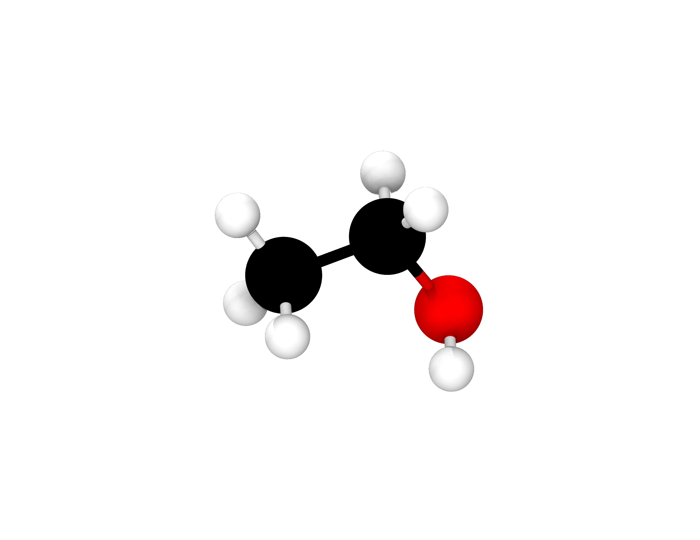
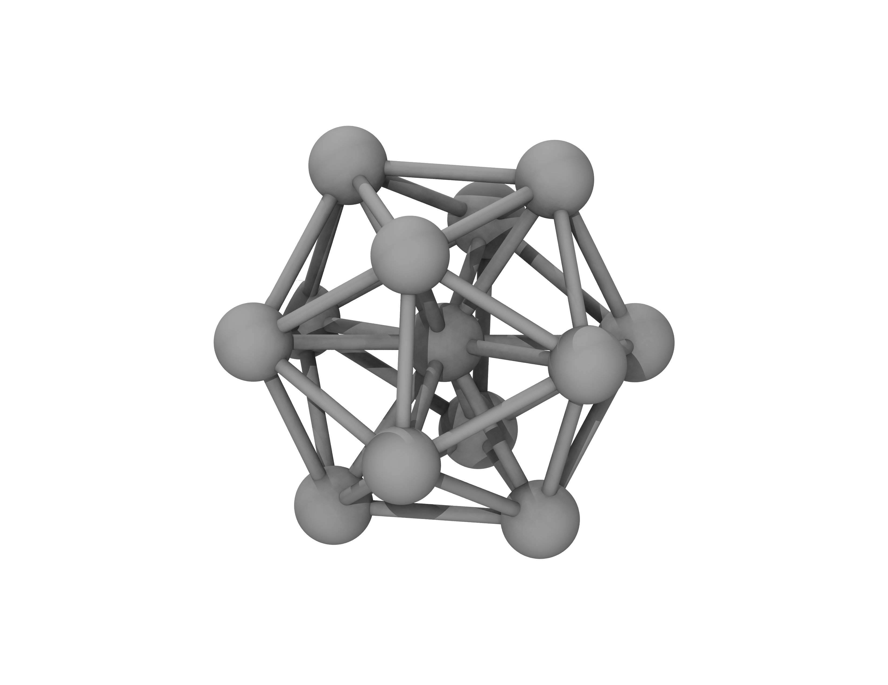

===================
Geometry Relaxation
===================

:Author: Loukas Kollias, University of Southampton, United Kingdom
:Author: Chris-Kriton Skylaris, University of Southampton, United Kingdom

:Date: November 2022

.. role:: raw-latex(raw)
   :format: latex
..

.. raw:: latex

   \maketitle

.. contents:: Table of Contents
   :depth: 3
   :local:
   :backlinks: none

Introduction to geometry relaxation
===================================

Geometry relaxation is a process that moves the positions of atomic
nuclei to their equilibrium values in a system. This system can be a
chemical structure of higher organisation, e.g., a molecule, a cluster
of molecules, or a crystal lattice. It is often called geometry
optimisation as it is an optimisation process, where the objective
function is the total energy of the system. More elaborately, it is a
process that searches for a solution to a minimisation problem, i.e.,
minimise the total energy that is a function of the atomic coordinates.
In place of atomic coordinates, we usually consider the positions of the
nuclei of atoms in the system. This is performed in an iterative fashion
and a candidate solution is provided at every iteration that is called a
"step". At every step, the optimisation algorithm dislocates the
positions of the nuclei then it optimizes the electronic structure, and
finally it calculates the total energy of the chemical structure.
Consequently, a geometry optimisation is a series of single point energy
calculations that completes when certain convergence criteria are met.
In ONETEP, geometry relaxation (optimisation) is invoked by setting the
:math:`\mathrm{TASK}` variable in the input file as,

.. math::
  \begin{aligned}
     \mathrm{task:\ GeometryOptimization}
  \end{aligned}

Potential Energy Surface
------------------------

The potential energies, E, of all possible configurations
:math:`(\mathbf{R}_{A}, \mathbf{R}_{B}, \ldots, \mathbf{R}_{N})`
of the atoms in the system lie on a surface. This is called the potential energy
surface (PES), and it is characterised by the equation below,

.. math::
  :label: total_energy_equation

   \begin{aligned}
      E=E(\mathbf{R}_A, \mathbf{R}_B, \ldots, \mathbf{R}_N)
   \end{aligned}

The PES is the search domain of the optimisation algorithm, even though
most geometry relaxation methods search in a region close to the initial
guess structure provided by the user. Each point on the PES is
associated with a value of the potential energy and a specific
configuration of atoms. The initial guess geometry can be set in various
ways, e.g., from experiment or based on a crystal lattice. This
structure is now a point on the PES and has an associated energy We need
to navigate the PES so that we find points of lower energy, hence more
stable configurations compared to the initial one.

Local Optimisation
------------------

At the first step, updated atomic positions are calculated using an
optimisation method (these are discussed in section 4). The first and
second derivatives of the energy, E, with respect to atomic (nuclear)
positions, :math:`\mathbf{R}`, are often calculated to estimate the next
point. We remind the reader that the first derivative is related to the
forces on each atom as a result of its interaction with other atoms in
the system. This is a :math:`3N` matrix, where :math:`N` is the number
of atoms in the system it has the form [Scherlis2006]_,

.. math::
  :label: forces_equation

   \begin{aligned}
      \mathbf{F}_{A}=-\frac{dE}{d\mathbf{R}_A}
   \end{aligned}

where the nuclear coordinates of an atom A that belongs to the system
in Cartesian space are: :math:`\mathbf{R}_{A}=(x_{A},y_{A},z_{A})`. If the net
forces on the atoms are zero, then we have an extremum. Then we need to
calculate the second derivative to investigate if this is a minimum
(stable structure) or a maximum (transition state). The Hessian matrix
possesses information about the second derivatives, hence it is
frequently called the force constant matrix. This is a
:math:`3N\times 3N` matrix, and it can be written in the
following form for any atoms A, B in the system,

.. math::
  :label: hessian_equation

   \begin{aligned}
      \mathbf{H}_{AB}=\frac{\partial^{2}E}{\partial{\mathbf{R}_A} \partial {\mathbf{R}_B}}
   \end{aligned}

This calculation is important to examine if this point is a minimum. To
do this, vibrational frequencies are calculated from the Hessian
[Schlegel2011]_. A minimum is characterised by a net
zero force and positive vibrational frequencies. In simple terms, the
minimum is located where the first derivative is zero and the second
derivative (that is relevant to the local curvature) is positive.
Consequently, one needs to calculate the energy and its first and second
derivatives to investigate if a point on the PES is a minimum.

By default, the positions of all nuclei are modified during
optimisation. Nevertheless, we can exclude a subset of the nuclei of the
system from the optimisation. This way we can keep the positions of certain
nuclei constant, if needed, even when positions of other nuclei are changed.

Convergence Criteria
====================

There are a few criteria that can be examined to assess whether the
geometry relaxation has converged to a local minimum structure. These
include criteria concerning the energy and the net forces on atoms in
the system. Additionally, the geometry relaxation can be stopped if a
certain number of steps has been made regardless of the energy and
forces in the final structure. This is not really a convergence
criterion but it is important to be able to stop the process for a
number of reasons which are discussed later in this section.

Force tolerance
---------------

Atomic positions need to be relaxed as the net force on each atom should
be zero. Practically, it is difficult, if at all possible, to have a net
zero force on every atom. Consequently, this process minimizes the
magnitude of the net force on each atom so that it approaches zero as
much as possible, and within a certain tolerance. The default force
tolerance is 0.002 :math:`E_{H}\:a_{0}^{-1}`. This criterion can be
modified by the user through setting the following parameter in the
input file,

.. math::

  \begin{aligned}
    & \mathrm{geom\_force\_tol: [VALUE]\:[UNITS]}\\
    & \mathrm{e.g.,}\\
    & \mathrm{geom\_force\_tol: 0.051422\:eV/ang}\\
    & \mathrm{or}\\
    & \mathrm{geom\_force\_tol: 0.001\:Ha/bohr}\\
    & \mathrm{or}\\
    & \mathrm{geom\_force\_tol: 0.001}
  \end{aligned}

if units are not specified, they are thought to be
:math:`E_{H} a_{0}^{-1}`.

Maximum number of steps
-----------------------

Another criterion that can be assessed to stop the relaxation process is
the maximum number of steps to be made. The user can have both criteria,
so if any of those is satisfied after a certain step, then the process
is terminated. The maximum number of steps does not guarantee a minimum
energy structure, but it is a good check to stop the optimisation if it
does not descend the PES in a satisfactory way or if the time of the
calculation is limited. In any case, it will provide us with a candidate
structure after a certain number of steps given an initial guess and a
specific optimisation algorithm. This criterion can be controlled by the
user through setting the following parameter in the input file,

.. math:: 

  \begin{aligned}
    & \mathrm{geom\_max\_iter: [VALUE]}\\
    & \mathrm{e.g.,}\\
    & \mathrm{geom\_max\_iter: 100}
  \end{aligned}

if this is not specified by the user in the input file, then its default
value is 50. This means that 50 geometry relaxation steps will be
performed at most. Fewer steps will be performed if other criteria, such
as force, energy tolerance, are satisfied before that.

Convergence window
------------------

The convergence window is the number of steps where all the criteria set
for the geometry relaxation must be satisfied to declare convergence.
The default value is 2 steps. This is recommended to achieve a balance
between accuracy and efficiency. This criterion can be controlled by the
user through setting the following parameter in the input file,

.. math::
  \begin{aligned}
    & \mathrm{geom\_convergence\_win: [VALUE]}\\
    & \mathrm{e.g.,}\\
    & \mathrm{geom\_convergence\_win: 3}
  \end{aligned}

Energy tolerance
----------------

Another convergence criterion that can be specified by the user is the
energy tolerance. This tells the geometry relaxation to stop if the
difference between the maximum and minimum energies per atom over
:math:`\mathrm{geom\_convergence\_win}` steps is less than this value.
The default value is :math:`10^{-6} E_{H}`. This criterion can be
controlled by the user through setting the following parameter in the
input file,

.. math::
  \begin{aligned}
    & \mathrm{geom\_energy\_tol: [VALUE]\: [UNITS]}\\
    & \mathrm{e.g.,}\\
    & \mathrm{geom\_energy\_tol: 1e-7\:Ha}\\
    & \mathrm{or}\\
    & \mathrm{geom\_energy\_tol: 2.72e-6\:eV}\\
  \end{aligned}

Displacement tolerance
----------------------

Another way to check if the geometry relaxation has converged is to
assess the maximum displacement of the positions of the nuclei. In
practice, we calculate the set of distances of nuclei between two
consecutive steps. If the largest value in this set is equal to or less
than the tolerance, then the maximum distance that an atom has been
displaced is considered small enough to tell the optimisation to stop.
In other words, atoms have not moved considerably between two
consecutive steps, hence the relaxation has converged. The default value
is :math:`0.005\:a_{0}`. If units are not defined, then these are
thought to be :math:`a_{0}`. Units "ang" correspond to |AA|. This
criterion can be controlled by the user through setting the
following parameter in the input file,

.. math::
  \begin{aligned}
    & \mathrm{geom\_disp\_tol: [VALUE]\:[UNITS]}\\
    & \mathrm{e.g.,}\\
    & \mathrm{geom\_disp\_tol: 0.002\:bohr}\\
    & \mathrm{or}\\
    & \mathrm{geom\_disp\_tol: 0.001\:ang}
  \end{aligned}

Options
=======

Output detail
-------------

The output detail of the geometry relaxation process can be controlled
by the user. The default behaviour is to follow the
:math:`\mathrm{output\_detail}` variable that controls the overall
output detail of the ONETEP calculation. The available settings for
this variable are :math:`\mathrm{BRIEF}`, :math:`\mathrm{NORMAL}`,
:math:`\mathrm{VERBOSE}`, :math:`\mathrm{PROLIX}`, and 
:math:`\mathrm{MAXIMUM}`. The level of the output detail relevant
to geometry relaxation can be controlled by setting the following
parameter in the input file,

.. math::
  \begin{aligned}
    & \mathrm{geom\_output\_detail: [VALUE]}\\
    & \mathrm{e.g.,}\\
    & \mathrm{geom\_output\_detail: VERBOSE}
  \end{aligned}

Continuation
------------

The user can select whether to continue from a previous geometry
relaxation or start from scratch. The default value of this logical
variable is :math:`\mathrm{FALSE}` that means geometry relaxations start
from scratch. This option can be controlled by the user through setting
the following parameter in the input file,

.. math::
  \begin{aligned}
    & \mathrm{geom\_continuation: [VALUE]}\\
    & \mathrm{e.g.,}\\
    & \mathrm{geom\_continuation: FALSE}
  \end{aligned}

Steps between backups
---------------------

The user can control the number of geometry optimisation steps between
backups of all data for continuation. In other words, this tells the
program to write a backup for continuation every
:math:`\mathrm{geom\_backup\_iter}` steps. The default value of this
variable is 1, so ONETEP writes a backup after every step of the
geometry relaxation. This value can be increased to save time on
writing continuation data. This option can be controlled by the user
through setting the following parameter in the input file,

.. math::
  \begin{aligned}
    & \mathrm{geom\_backup\_iter: [VALUE]}\\
    & \mathrm{e.g.,}\\
    & \mathrm{geom\_backup\_iter: 2}
  \end{aligned}

Density Kernel and NGWFs
------------------------

Steps between reset of density kernel and NGWFs
~~~~~~~~~~~~~~~~~~~~~~~~~~~~~~~~~~~~~~~~~~~~~~~

The user can control the stride with which the density kernel and the
Nonorthogonal Generalized Wannier Functions (NGWFs) are being reset. In
other words, this tells the program to reset the kernel and NGWFs every
:math:`\mathrm{geom\_reset\_dk\_ngwfs\_iter}` steps. The default value
of this variable is 6, so ONETEP resets these quantities every 6
geometry relaxation steps. Resetting the density kernel and NGWFs
every once in a while can prevent problems in converging the energy
of the NGWFs during optimisation. This option can be controlled by
the user through setting the following parameter in the input file,

.. math::
  \begin{aligned}
    & \mathrm{geom\_reset\_dk\_ngwfs\_iter: [VALUE]}\\
    & \mathrm{e.g.,}\\
    & \mathrm{geom\_reset\_dk\_ngwfs\_iter: 10}
  \end{aligned}

Reuse density kernel and NGWFs
~~~~~~~~~~~~~~~~~~~~~~~~~~~~~~

The user can control whether to re-use an existing density kernel and
set of NGWFs. The default value of this logical variable is
:math:`\mathrm{TRUE}` except from the case of a Density-Functional based
Tight-Binding (DFTB) calculation, where it is :math:`\mathrm{FALSE}` by
default. This option can be controlled by the user through setting
the following parameter in the input file,

.. math::
  \begin{aligned}
    & \mathrm{geom\_reuse\_dk\_ngwfs: [VALUE]}\\
    & \mathrm{e.g.,}\\
    & \mathrm{geom\_reuse\_dk\_ngwfs: FALSE}
  \end{aligned}

Geometry Relaxation methods
===========================

There is a variety of optimisation algorithms implemented in ONETEP. The
user can select which algorithm to use by setting the following
parameter in the input file,

.. math::
  \begin{aligned}
    & \mathrm{geom\_method: [VALUE]}\\
    & \mathrm{e.g.,}\\
    & \mathrm{geom\_method: TPSD}
  \end{aligned}

These methods are being discussed in this section.

BFGS
----

The Broyden-Fletcher-Goldfard-Shanno (BFGS) algorithm is a very popular
quasi-Newton optimisation method that is implemented in various
computational chemistry codes, including ONETEP. In ONETEP, the BFGS
algorithm follows the implementation by Pfrommer et al.
[Pfrommer1997]_. This method uses an initial Hessian
matrix that is updated in an iterative fashion. The domain of this
Hessian includes both internal and cell degrees of freedom, hence both
nuclear coordinates, :math:`\mathbf{R}`, and lattice vectors,
:math:`\mathbf{h}`, are relaxed. The following notation is used for the
lattice vectors,

.. math::
  :label: lattice_vectors_equation

   \begin{aligned}
   \mathbf{h}=[UVW]\end{aligned}

in more detail, if the unit vectors along the x, y, and z directions in
Cartesian space are :math:`\mathbf{\hat{i}}`, :math:`\mathbf{\hat{j}}`,
and :math:`\mathbf{\hat{k}}`, respectively, then

.. math::
  :label: lattice_vectors_cartesian_equation

   \begin{aligned}
   \mathbf{h} = U\mathbf{\hat{i}} + V\mathbf{\hat{j}} + W\mathbf{\hat{k}}\end{aligned}

The BFGS algorithm uses information from both forces and the Hessian
matrix to investigate a minimum. The latter is computationally expensive
as it is :math:`O(N^2)` [Aarons]_. The Hessian should
be an operator that transforms between the changes in nuclear positions
and forces,

.. math::
  :label: bfgs_hessian_update_equation

   \begin{aligned}
   \mathbf{H}_{n+1}\Delta \mathbf{R}_n=\Delta \mathbf{F}_n\end{aligned}

where :math:`\mathrm{\Delta \mathbf{R}_n}` and
:math:`\mathrm{\Delta \mathbf{F}_n}` are the changes in positions and
forces between steps :math:`n-1` and :math:`n`, respectively.

Then, the algorithm updates its guess solution based on,

.. math::
  :label: bfgs_hessian_update_algorithm_equation

   \begin{aligned}
   \mathbf{H}_{n+1}^{-1}=(\mathbf{I}-\mathbf{A})\mathbf{H}_{n}^{-1}(\mathbf{I}-\mathbf{A})+\mathbf{A}\end{aligned}

where,

.. math::
  :label: bfgs_alpha_equation

   \begin{aligned}
   \mathbf{A}=\mathbf{\rho}_{n}\Delta\mathbf{F}_n(\Delta\mathbf{R}_n)^{T}\end{aligned}

.. math::
  :label: bfgs_rho_equation

   \begin{aligned}
   \mathbf{\rho}_{n}=\frac{1}{(\Delta\mathbf{F}_n)^{T}\Delta\mathbf{R}_n}\end{aligned}

Therefore, the BFGS algorithm updates the inverse Hessian matrix at
every step, as it is more computationally efficient than updating the
Hessian and then inverting it at every step. At last, the BFGS algorithm
can be selected by setting the :math:`\mathrm{geom\_method}` variable to
:math:`\mathrm{BFGS}` in the ONETEP input file.

Initial Inverse Hessian Matrix
~~~~~~~~~~~~~~~~~~~~~~~~~~~~~~

In ONETEP, the initial inverse Hessian matrix is set up as,

.. math::
  :label: initial_inverse_matrix_equation

   \begin{aligned}
   H_{0}^{-1}=
   \begin{bmatrix}
       (3\Omega B_{0})^{-1} & 0 & \dots & & & 0 \\
       0 & \ddots & 0 & \dots & & \vdots \\
       \vdots & 0 & (3\Omega B_{0})^{-1} & 0 & \dots & \\
       & \vdots & 0 & g_{0}^{-1}\langle m_{ionic}^{-1}\rangle\omega_{0}^{-2} & 0 &  & \\
       &&\vdots & 0 &\ddots&0\\
       0 & \dots & & & 0 & g_{0}^{-1}\langle m_{ionic}^{-1}\rangle\omega_{0}^{-2}
   \end{bmatrix}
   \end{aligned}

.. math::
  :label: initial_inverse_matrix_omega

   \begin{aligned}
   \Omega = det(\mathbf{h})
   \end{aligned}

.. math::
  :label: initial_inverse_matrix_h

   \mathbf{h}=(1+\epsilon)\mathbf{h_{0}}

.. math::
  :label: initial_inverse_matrix_g0

   \mathbf{g_{0}}=\mathbf{h_{0}}^{T}\mathbf{h_{0}}

where :math:`\mathrm{B_{0}}` is the bulk modulus, :math:`\Omega` is the
cell volume, :math:`\mathbf{g_{0}}` is the :math:`3N \times 3N` metric
tensor of the initial configuration,
:math:`\mathrm{\langle m_{ionic} \rangle}` is the average ionic mass,
:math:`\mathrm{\omega_{0}^{-2}}` is the average phonon frequency at the
:math:`\mathrm{\Gamma}` point, and :math:`\epsilon` is the finite strain
tensor. This is a block-diagonal matrix. The upper left
:math:`(9 \times 9)` diagonal part describes cell-cell interactions,
while the bottom right :math:`(3N \times 3N)` diagonal part describes
ion-ion interactions. This way, we can calculate elastic properties and
phonon frequencies at the :math:`\Gamma`-Point
[Pfrommer1997]_ [Aarons]_.

Line Search
~~~~~~~~~~~

So far we have learnt how to calculate the energy, its gradient and its
Hessian with respect to nuclear positions. Now we are interested in how
to decide where the next point for which these quantities are calculated
should be on the PES. In simple terms, we need to find out where we
should look after calculating the energy of a point and the local
curvature of its region. We identify the search direction,
:math:`p_{n}`, after every geometry relaxation step using the following
expression,

.. math::
  :label: line_search_direction_equation

   \begin{aligned}
   \mathbf{p}_{n}=-\mathbf{H}_{n}^{-1}\nabla E(\mathbf{R}_{n})\end{aligned}

hence the next point is calculated using the search direction and an
arbitrarily chosen step length, :math:`\lambda_{n}`, as follows,

.. math::
  :label: line_search_step_length_equation

   \begin{aligned}
   \mathbf{R}_{n+1}=\mathbf{R}_{n}+\lambda_{n}\mathbf{p}_{n},\hspace{0.5cm}\lambda_{n}>0\end{aligned}

Conditions for step length
~~~~~~~~~~~~~~~~~~~~~~~~~~

The step length, :math:`\lambda_{n}`, should be determined following
Wolfe’s conditions [Wolfe1969]_ [Wolfe1971]_.
In ONETEP, weak Wolfe-Powell conditions are used.
These are described in detail by Gilbert
[Gilbert1997]_ and Yuan et al.
[Yuan2017]_. The following conditions should be
satisfied for the next step, :math:`\mathbf{R}_{n+1}`,

.. math::
  :label: wolfes_condition_1_equation

   \begin{aligned}
       E(\mathbf{R}_{n+1}) \leq E(\mathbf{R}_{n}) + \omega_{1}\lambda_{n}\nabla E(\mathbf{R}_{n})^{T}\mathbf{p}_{n}
   \end{aligned}

.. math::
  :label: wolfes_condition_2_equation

   \begin{aligned}
       \nabla E(\mathbf{R}_{n+1})^{T}\mathbf{p}_{n}\geq  \omega_{2}\nabla E(\mathbf{R}_{n})^{T}\mathbf{p}_{n}
   \end{aligned}

.. math::
  :label: wolfes_condition_3_equation

   \begin{aligned}
       0<\omega_{1}<0.5
   \end{aligned}

.. math::
  :label: wolfes_condition_4_equation

   \begin{aligned}
       \omega_{1}<\omega_{2}<1
   \end{aligned}

where :math:`\omega_{1}` and :math:`\omega_{2}` are constants
independent of the current step. These conditions lead to a descending
search direction on the PES [Gilbert1997]_ [Yuan2017]_.
They also help with the convergence of the
optimisation algorithm [Gilbert1997]_ [Yuan2017]_.

Limited-Memory BFGS (L-BFGS)
----------------------------

The limited-memory BFGS (L-BFGS) method can be useful when we have large
systems, hence the computational cost of calculating the Hessian matrix
is very high. In L-BFGS, the Hessian, that is a
:math:`\mathrm{(3N + 9) \times (3N + 9)}` matrix, where :math:`\mathrm{N}` is the
number of atoms in the system, is not stored in full. A set of vectors
of length :math:`\mathrm{N}` is stored instead, hence the optimisation
converges at a linear rate. An approximate Hessian matrix is constructed
based on the matrix that was used in the last few steps. This matrix
should be sparse, symmetric, and positive-definite
[Liu1989]_. As in the standard BFGS algorithm, the
inverse Hessian matrix is updated at each optimisation step. In L-BFGS,
we do not need to store the Hessian but we need to access information
about the positions and gradients at previous steps
[Packwood2016]_. We choose to store a certain number of
sets of positions and gradients, namely :math:`\mathrm{m}`, and every
time a new optimisation step is made, the oldest set is removed from
storage to make space for the latest set to be stored. The number of
sets, :math:`\mathrm{m}` is specified by the user. By default, ONETEP
uses :math:`\mathrm{m}` equal to 30. We declare the difference in
positions and gradients between steps :math:`n-1` and :math:`n` as
:math:`\mathrm{s_{n}}` and :math:`\mathrm{y_{n}}`. Then, we have the
following expressions [Aarons]_,

.. math::
  :label: lbfgs_coordinates_change_equation

  \begin{aligned}
  \mathbf{s}_{n}=\mathbf{R}_{n}-\mathbf{R}_{n-1}
  \end{aligned}

.. math::
  :label: lbfgs_gradients_change_equation

  \begin{aligned}
  \mathbf{y}_{n}=\nabla E(\mathbf{R}_{n})-\nabla E(\mathbf{R}_{n-1})
  \end{aligned}

.. math::
  :label: lbfgs_rho_equation

  \begin{aligned}
  \mathbf{\rho}_{n}=\frac{1}{\mathbf{y}_{n}^{T}\mathbf{s}_{n}}
  \end{aligned}

.. math::
  :label: lbfgs_coordinates_vector_equation

  \begin{aligned}
  \mathbf{S}_{n} = \begin{bmatrix}
  \mathbf{s}_{0},...,\mathbf{s}_{n-1}
  \end{bmatrix}
  \end{aligned}

.. math::
  :label: lbfgs_gradients_vector_equation

  \begin{aligned}
  \mathbf{Y}_{n} = \begin{bmatrix}
  \mathbf{y}_{0},...,\mathbf{y}_{n-1}
  \end{bmatrix}
  \end{aligned}

An initial approximation of the inverse Hessian matrix,
:math:`H^{-1}_{0}`, is used at the first iteration of the algorithm. In
contrast with the standard BFGS, the initial matrix approximation can be
different at each step [Liu1989]_. The inverse Hessian
can be updated using [Byrd1994]_,

.. math::
  :label: lbfgs_hessian_update_main_equation

  \begin{aligned}
  \mathbf{H}^{-1}_{n}=\mathbf{H}^{-1}_{0}+
  \begin{bmatrix}
  \mathbf{S}_{n} & \mathbf{H}^{-1}_{0}\mathbf{Y}_{n}
  \end{bmatrix} \mathbf{W}_{n} \begin{bmatrix}
  \mathbf{S}^{T}_{n}\\
  \mathbf{Y}^{T}_{n}\mathbf{H}^{-1}_{0}
  \end{bmatrix}\\
  \end{aligned}

.. math::
  :label: lbfgs_hessian_update_w_equation

  \begin{aligned}
  \mathbf{W}_{n}=\begin{bmatrix}
  \mathbf{R}_{n}^{-T}(\mathbf{D}_{n}+\mathbf{Y}^{T}_{n}\mathbf{H}^{-1}_{0}\mathbf{Y}_{n})\mathbf{R}_{n}^{-T} & -\mathbf{R}^{-T}_{n}\\
  -\mathbf{R}^{-T}_{n} & 0
  \end{bmatrix}\\
  \end{aligned}

.. math::
  :label: lbfgs_hessian_update_d_equation

  \begin{aligned}
  \mathbf{D}_{n} = \begin{bmatrix}
  \mathbf{s}^{T}_{0}\mathbf{y}_{0} & 0 & \ldots & 0 \\
  0 & \mathbf{s}^{T}_{1}\mathbf{y}_{1} & & \vdots \\
  \vdots & & \ddots & 0 \\
  0 & \ldots & 0 & \mathbf{s}^{T}_{n}\mathbf{y}_{n}
  \end{bmatrix}
  \end{aligned}

In BFGS, :math:`\mathbf{H}^{-1}_{n}` is multiplied by vector
:math:`\mathbf{v}` and gives a product vector, :math:`\mathbf{p}`.

.. math::
  :label: lbfgs_hessian_calculation_equation

   \begin{aligned}
       \mathbf{p} \rightarrow \mathbf{H}^{-1}_{n}\mathbf{v}
   \end{aligned}

but in L-BFGS we do not compute :math:`\mathbf{H}^{-1}_{n}`.
Consequently, we need to find a way to obtain vector :math:`\mathbf{p}`.
In ONETEP, this is achieved by using the Basic Linear Algebra Subprogram
(BLAS) libraries to perform matrix operations in the following fashion
as explained in detail in [Aarons]_,

.. math::
  :label: lbfgs_algorithm_1_equation

   \begin{aligned}
       \mathbf{p} = \mathbf{H}_{0}^{-1}\mathbf{v}
   \end{aligned}

.. math::
  :label: lbfgs_algorithm_2_equation

   \begin{aligned}
       \mathbf{w}_{1:m}=\mathbf{Y}_{n}^{T}\mathbf{p}
   \end{aligned}

.. math::
  :label: lbfgs_algorithm_3_equation

   \begin{aligned}
       \mathbf{w}_{m+1:2m}=\mathbf{S}_{n}^{T}\mathbf{v}
   \end{aligned}

.. math::
  :label: lbfgs_algorithm_4_equation

   \begin{aligned}
       \mathbf{w}_{1:m} \rightarrow \mathbf{R}_{n}^{-1}\mathbf{Y}_{n}^{T}\mathbf{H}_{0}^{-1}\mathbf{v}
   \end{aligned}

.. math::
  :label: lbfgs_algorithm_5_equation

   \begin{aligned}
       \mathbf{w}_{m+1:2m} \rightarrow \mathbf{R}_{n}^{-1}\mathbf{S}_{n}^{T}\mathbf{v}
   \end{aligned}

.. math::
  :label: lbfgs_algorithm_6_equation

   \begin{aligned}
       \mathbf{\Xi} = \mathbf{T}_{n}
   \end{aligned}

.. math::
  :label: lbfgs_algorithm_7_equation

   \begin{aligned}
       \mathbf{\Xi} \rightarrow \mathbf{R}_{n}^{-1} \mathbf{\Xi}
   \end{aligned}

.. math::
  :label: lbfgs_algorithm_8_equation

   \begin{aligned}
       \mathbf{w}_{1:m} \rightarrow \mathbf{w}_{1:m}- \mathbf{\Xi} \mathbf{w}_{m+1:2m}
   \end{aligned}

.. math::
  :label: lbfgs_algorithm_9_equation

   \begin{aligned}
       \mathbf{p} \rightarrow \mathbf{p} + \mathbf{S}_{n}^{T}\mathbf{w}_{1:m}
   \end{aligned}

.. math::
  :label: lbfgs_algorithm_10_equation

   \begin{aligned}
       \mathbf{t} = -\mathbf{Y}_{n}^{T}\mathbf{w}_{m+1:2m}
   \end{aligned}

.. math::
  :label: lbfgs_algorithm_11_equation

   \begin{aligned}
       \mathbf{p} \rightarrow \mathbf{p} + \mathbf{H}_{0}^{-1}\mathbf{t}
   \end{aligned}

where, :math:`\mathbf{w}`, :math:`\mathbf{t}` are vectors of lengths
:math:`\mathrm{2m}` and :math:`\mathrm{n}`, respectively.
:math:`\mathbf{\Xi}` is a :math:`\mathrm{m \times m}` matrix. The L-BFGS
algorithm uses this procedure until convergence.

.. _options-1:

Options
~~~~~~~

The following variables can be set when the L-BFGS algorithm is
selected. The user is advised to follow the default behaviour here.
Nevertheless, there is an option to modify these settings as explained
in the following text.

-  | L-BFGS maximum updates
   | This variable determines the number of vectors updated in L-BFGS.
     The default value is 30. This means that 30 vectors will be updated
     at each iteration. This variable can be controlled by the user
     through setting the following parameter in the input file,

   .. math::

     \begin{aligned}
       &  \mathrm{lbfgs\_max\_updates: [VALUE]}\\
       &  \mathrm{e.g.,}\\
       &  \mathrm{lbfgs\_max\_updates: 30}
     \end{aligned}

-  | L-BFGS block length
   | This variable determines the number of updates that are stored in
     an unbounded L-BFGS calculation before reallocation. The default
     value is 30. This means that 30 updates will be stored. This
     variable can be controlled by the user through setting the
     following parameter in the input file,

   .. math::
     \begin{aligned}
      &  \mathrm{lbfgs\_block\_length: [VALUE]}\\
      &  \mathrm{e.g.,}\\
      &  \mathrm{lbfgs\_block\_length: 30}
     \end{aligned}

-  | Estimated bulk modulus
   | The user can provide an estimate of the bulk modulus. The default
     value of this variable is 0.017 :math:`E_{H}\:a_{0}^{-3}`. This is
     one of the parameters used to initialize the inverse Hessian
     matrix. This option can be controlled by the user through setting
     the following parameter in the input file,

   .. math::
     \begin{aligned}
      &  \mathrm{geom\_modulus\_est: [VALUE]\: [UNITS]}\\
      &  \mathrm{e.g.,}\\
      &  \mathrm{geom\_modulus\_est: 0.02\: Ha\:/\:bohr**\:3}
     \end{aligned}

-  | Estimated average phonon frequency
   | The user can provide an estimate of the average phonon frequency at
     the :math:`\Gamma`-point. The default value of this variable is
     0.0076 :math:`E_{H}`. This is one of the parameters used to
     initialize the inverse Hessian matrix. This option can be
     controlled by the user through setting the following parameter in
     the input file,

   .. math::
     \begin{aligned}
       &  \mathrm{geom\_frequency\_est: [VALUE]\: [UNITS]}\\
       & \mathrm{e.g.,}\\
       & \mathrm{geom\_frequency\_est: 0.008\:Ha}\\
       & \mathrm{or}\\
       & \mathrm{geom\_frequency\_est: 0.218\:eV}
     \end{aligned}

-  | Print inverse Hessian matrix
   | The user can choose whether to print the inverse Hessian matrix.
     The default value of this variable is :math:`\mathrm{FALSE}`, so
     this matrix is not printed unless the user specifies otherwise.
     This option can be controlled by the user through setting the
     following parameter in the input file,

   .. math::
     \begin{aligned}
        & \mathrm{geom\_print\_inv\_hessian: [VALUE]}\\
        & \mathrm{e.g.,}\\
        & \mathrm{geom\_print\_inv\_hessian: FALSE}
     \end{aligned}

Also, certain preconditioners can be used in the L-BFGS algorithm. These
are the exponential (EXP) [Packwood2016]_ and
forcefield (FF)-based [Mones2018]_ preconditioners. It
should be noted that no preconditioner is used by default.
Preconditioner options are preset to default values, but the user has
the option to change these, if needed. These are
:math:`\mathrm{r_{cut}}`, :math:`\mathrm{r_{NN}}`, :math:`\mathrm{A}`,
:math:`\mathrm{\mu}`, and they are used in the following expressions to
define the preconditioner :math:`\mathrm{P}` options. Either can be
selected by setting the following variable in the input file,

   .. math::
     \begin{aligned}
        & \mathrm{geom\_precond\_type: [VALUE]}\\
        & \mathrm{e.g.,}\\
        & \mathrm{geom\_precond\_type: EXP}
     \end{aligned}

The preconditioners can be modified (if needed) by setting the
appropriate variables,

   .. math::
     \begin{aligned}
        & \mathrm{geom\_precond\_exp\_c\_stab: [VALUE]}\\
        & \mathrm{e.g.,}\\
        & \mathrm{geom\_precond\_exp\_c\_stab: 0.1}\\
        & \\
        & \\
        & \mathrm{geom\_precond\_exp\_a: [VALUE]}\\
        & \mathrm{e.g.,}\\
        & \mathrm{geom\_precond\_exp\_a\_stab: 3.0}\\
        & \\
        & \\
        & \mathrm{geom\_precond\_exp\_r\_nn: [VALUE]\ [UNITS]}\\
        & \mathrm{e.g.,}\\
        & \mathrm{geom\_precond\_exp\_r\_nn: 0.1\:bohr}\\
        & \\
        & \\
        & \mathrm{geom\_precond\_exp\_r\_cut: [VALUE] [UNITS]}\\
        & \mathrm{e.g.,}\\
        & \mathrm{geom\_precond\_exp\_r\_cut: 0.1\:bohr}\\
        & \\
        & \\
        & \mathrm{geom\_precond\_exp\_mu: [VALUE] [UNITS]}\\
        & \mathrm{e.g.,}\\
        & \mathrm{geom\_precond\_exp\_mu: 0.1\: Ha\:/\:bohr**\:2}\\
        & \\
        & \\
        & \mathrm{geom\_precond\_ff\_c\_stab: [VALUE] [UNITS]}\\
        & \mathrm{e.g.,}\\
        & \mathrm{geom\_precond\_ff\_c\_stab: 0.1\: Ha\:/\:bohr**\:2}\\
        & \\
        & \\
        & \mathrm{geom\_precond\_ff\_r\_cut: [VALUE] [UNITS]}\\
        & \mathrm{e.g.,}\\
        & \mathrm{geom\_precond\_ff\_r\_cut: 3.8\:bohr}\\
     \end{aligned}

At last, the L-BFGS algorithm can be selected by setting the
:math:`\mathrm{geom\_method}` variable to :math:`\mathrm{LBFGS}` in the
ONETEP input file.

Coordinate system
~~~~~~~~~~~~~~~~~

The user can choose if Cartesian or internal (delocalised) coordinates
will be used during geometry relaxation. The latter are generated based
on the implementation by Andzelm et al. [Andzelm2001]_.
Cartesian coordinates are used in all geometry relaxation methods by
default. The user can select which system of coordinates to use by
setting the :math:`\mathrm{geom\_method}` variable to either
:math:`\mathrm{CARTESIAN}` or :math:`\mathrm{DELOCALIZED}`. For the
latter, only the BFGS method is used. The use of delocalised coordinates
can improve performance of the geometry relaxation. When Cartesian
coordinates are selected by setting the :math:`\mathrm{geom\_method}`
variable in the input file, the user can choose whether to do a
:math:`\mathrm{BFGS}` or :math:`\mathrm{L-BFGS}` optimisation by setting
the parameter to :math:`\mathrm{FALSE}` or :math:`\mathrm{TRUE}`,
respectively. This is shown below,

   .. math::
     \begin{aligned}
        & \mathrm{geom\_lbfgs: [VALUE]}\\
        & \mathrm{e.g.,}\\
        & \mathrm{geom\_lbfgs: TRUE}
     \end{aligned}

Two-point Steepest Descents (TPSD)
----------------------------------

The two-point steepest descents (TPSD) optimisation algorithm is
implemented in ONETEP. This is based on the work of Barzilai and Borwein
[Barzilai1988]_. The update equation can be obtained in
the same way as in the BFGS algorithm. The search direction,
:math:`p_{n}`, can be calculated as,

.. math::
  :label: tpsd_search_direction_equation

   \begin{aligned}
      p_{n}=-\nabla E(\mathbf{R}_{n})
   \end{aligned}

In this method, we need to calculate the change in atomic positions,
:math:`\Delta\mathbf{R}`, and the gradient of the energy with respect to
atomic position, :math:`\Delta(\nabla E (\mathbf{R}))`, between the
current iteration, :math:`i`, and the previous one, :math:`i-1`. Please
note that in what follows in this section, we will just rename the
quantity :math:`\nabla E (\mathbf{R}_{i})` to :math:`\mathbf{g}_{i}` for
simplicity.

.. math::
  :label: tpsd_coordinates_equation

   \begin{aligned}
      \Delta\mathbf{R}=\mathbf{R}_{i}-\mathbf{R}_{i-1}
   \end{aligned}

.. math::
  :label: tpsd_gradients_equation

   \begin{aligned}
      \Delta\mathbf{g}=\mathbf{g}_{i}-\mathbf{g}_{i-1}
   \end{aligned}

consequently, the step length, :math:`\lambda_{n}`, is calculated
either as,

.. math::
  :label: tpsd_step_1_equation

   \begin{aligned}
      \lambda_{n}=\frac{\Delta\mathbf{R} \cdot \Delta\mathbf{g}}{\Delta\mathbf{g} \cdot \Delta\mathbf{g}}
   \end{aligned}

this way we minimise the quantity
:math:`\lVert\Delta\mathbf{R}-\lambda\Delta\mathbf{g}\rVert^{2}` with
respect to :math:`\lambda`. In ONETEP, this equation is used to calculate the step length, :math:`\lambda_{n}`, 
by default. Symmetrically, we can use,

.. math::
  :label: tpsd_step_2_equation

   \begin{aligned}
      \lambda_{n}=\frac{\Delta \mathbf{R} \cdot \Delta \mathbf{R}}{\Delta \mathbf{R} \cdot \Delta \mathbf{g}}
   \end{aligned}

to minimise the quantity
:math:`\lVert\lambda\Delta\mathbf{R}-\Delta\mathbf{g}\rVert^{2}` with
respect to :math:`\lambda`.

At last, the TPSD algorithm can be selected by
setting the :math:`\mathrm{geom\_method}` variable to
:math:`\mathrm{TPSD}` in the ONETEP input file.

ASE Optimizers
--------------

In addition to the optimisation algorithms implemented in ONETEP, all
optimisation algorithms available in the Atomic Simulation Environment
(ASE) [ase_optimizers_website]_ can be used as well.
This can be done through the interface between ONETEP and ASE
[onetep_ase_interface]_. This way, ONETEP works as the
calculator that ASE uses to compute the energy and forces of a given
system at each step of the relaxation process. Then, the propagation of
the geometry relaxation process, i.e., the search direction, step
length, and propagation formula, is handled by the optimisation
algorithm selected in ASE.

Using the interface between ONETEP and the Atomic Simulation Environment (ASE)
==============================================================================

Requirements
------------

Before using the ONETEP / ASE interface, we need to make sure that we
have installed python (preferably version 3 as the following code is
written using python3 syntax). Then, we should have installed the
following python packages: ASE (Atomic Simulation Environment), and OS
(Operating System). The OS package lets us execute ONETEP as well as
read and write ONETEP files. A couple of important packages that is
highly recommended to be installed are NumPy (Numerical Python) and
SciPy (Scientific Python). These handle advanced numerical (e.g., linear
algebra, powers, etc.) and scientific calculations (e.g., integration,
interpolation, etc.), respectively. The ASE package allows for the
manipulation of atomic/molecular systems. An interface between ONETEP
and ASE is already in place and it lets us call ONETEP from ASE, make
calculations in ONETEP, and communicate back with ASE. The advantages of
using ASE with ONETEP are numerous. A number of these advantages is
given in the following list,

-  Optimisers built in ASE can be used to drive geometry relaxation in
   addition to the ones available in ONETEP.

-  Molecular systems can be manipulated, e.g., translated and rotated
   inside the unit cell.

-  Various python packages focused on molecular systems can be used in
   conjunction with the ASE/ONETEP interface. For example, packages for
   global optimisation can be used to find the global minimum on the
   PES.

-  We can easily convert between popular molecular input/output files.
   For example, we can convert a .cif file that contains
   crystallographic data to an .xyz atomic coordinate file that can be
   used in ONETEP.

-  ASE can be used as a standalone visualisation package. For example,
   it can be used to visualise a trajectory of atomic positions.

The aforementioned packages can be installed using

python3 -m pip install *package_name*

where one should replace *package_name* with the name of the *package* to
be installed. For example,

python3 -m pip install ase

In our case the names of the packages are,

-  os

-  ase

and optionally,

-  numpy

-  scipy

ONETEP / ASE interface using intrinsic optimisation algorithms
--------------------------------------------------------------

In this example, we see how to use the ONETEP / ASE interface while
opting for an optimisation algorithm that is already implemented in
ONETEP. The following code can be written (saved) to a file called
:math:`\mathrm{input\_intrinsic\_algorithm.py}`. Then, we could run our
ONETEP calculation by just running this python script as follows,

python3 input_intrinsic_algorithm.py > output_intrinsic_algorithm.log

where we redirect the output to a file called
:math:`\mathrm{output\_intrinsic\_algorithm.log}`.

This way, ASE creates an input file for ONETEP, then ONETEP performs the
geometry relaxation, and it communicates the energy and forces back to
ASE for post-processing and visualisation.

.. code:: python

    from os import environ, path
    from ase.build import molecule
    from ase.calculators.onetep import Onetep
    from ase.io import read,iread,write

    # set ONETEP run command by providing the full
    # path to the ONETEP executable. Here we also 
    # set the number of MPI ranks and threads per rank
    # based on what resources we have asked for.
    environ["ASE_ONETEP_COMMAND"]="export OMP_NUM_THREADS=$SLURM_THREADS_PER_CORE; srun -n $SLURM_NPROCS /path/to/onetep/bin/onetep PREFIX.dat >> PREFIX.out 2> PREFIX.err"

    # read atomic positions from an .xyz file
    # that is in the same directory.
    mol = read('./mymolecule.xyz')

    # set lattice vectors (in Angstrom)
    # replace xx, xy, xz, yx, yy, yz,
    # zx, zy, zz with desired values
    # for the lattice vectors
    mol.set_cell([[xx,xy,xz],
                  [yx,yy,yz],
                  [zx,zy,zz]])

    # set calculator as Onetep and a
    # label for input and output files.
    calc_label = 'mylabel'
    calc = Onetep(label=calc_label)

    # set Onetep parameters (left-hand side) and
    # corresponding values (right-hand side).
    # change atom name "A" and any other
    # value you want in the code below.
    calc.set(pseudo_path='/path/to/pseudo/',
             pseudo_suffix='.recpot',
             task='GeometryOptimization',
             geom_method='TPSD',
             geom_force_tol='0.05 "ev/ang"',
             write_forces=True,
             write_xyz=True,
             xc='PBE',
             cutoff_energy='1200 eV',
             species_ngwf_number={"A":10},
             species_ngwf_radius={"A":12.0}, # [bohr]
             write_hamiltonian=True,
             write_tightbox_ngwfs=True,
             write_denskern=True,
             output_detail='verbose',
             )

    # perform the calculation
    mol.calc = calc

    # get atomic positions, energy, and forces from the
    # calculator. In our case, the calculator is ONETEP.
    mol.get_positions()
    mol.get_forces()
    mol.get_potential_energy()

ONETEP / ASE interface using ASE optimisation algorithms
--------------------------------------------------------

In this example, we see how to use the ONETEP / ASE interface while
opting for an optimisation algorithm that is implemented in ASE. The
following code can be written (saved) to a file called
:math:`\mathrm{input\_ase\_algorithm.py}`. Then we could run our ONETEP
calculation by just running this python script as follows,

python3 input_ase_algorithm.py > output_ase_algorithm.log

where we redirect any output to a file called
:math:`\mathrm{output\_ase\_algorithm.log}`.

This way, ASE creates an input file for ONETEP, then ONETEP calculates
the energy and forces, and it communicates the energy and forces back to
ASE, then ASE updates the structure until the desired convergence
threshold has been reached. Final structures, energy, and forces are
available in ASE for post-processing and visualisation.

.. code:: python

    from os import environ, path
    from ase.build import molecule
    from ase.calculators.onetep import Onetep
    from ase.optimize.sciopt import SciPyFminBFGS
    from ase.io import read,iread,write

    # set ONETEP run command by providing the full
    # path to the ONETEP executable. Here we also
    # set the number of MPI ranks and threads per rank.
    # based on what resources we have asked for.
    environ["ASE_ONETEP_COMMAND"]="export OMP_NUM_THREADS=$SLURM_THREADS_PER_CORE; srun -n $SLURM_NPROCS /path/to/onetep/bin/onetep PREFIX.dat >> PREFIX.out 2> PREFIX.err"

    # read atomic positions from an .xyz file
    # that is in the same directory.
    mol = read('./mymolecule.xyz')

    # set lattice vectors (in Angstrom)
    # replace xx, xy, xz, yx, yy, yz,
    # zx, zy, zz with desired values
    # for the lattice vectors.
    # For orthogonal cells, you can set the cell as
    # mol.set_cell([xx,yy,zz])
    mol.set_cell([[xx,xy,xz],
                  [yx,yy,yz],
                  [zx,zy,zz]])

    # set calculator as Onetep and a
    # label for input and output files.
    calc_label = 'mylabel'
    calc = Onetep(label=calc_label)

    # set ONETEP parameters (left-hand side) and
    # corresponding values (right-hand side).
    # change atom name "A" and any other
    # value you want in the code below.
    calc.set(pseudo_path='/path/to/pseudo/potential/',
             pseudo_suffix='.recpot',
             task='SinglePoint',
             xc='PBE',
             cutoff_energy='1200 eV',
             species_ngwf_number={"A": 10},
             species_ngwf_radius={"A": 12.0}, # [bohr]
             write_hamiltonian=True,
             write_tightbox_ngwfs=True,
             write_denskern=True,
             output_detail='verbose',
             )

    # these files need to be read to
    # update the relaxation process.
    if path.isfile(calc_label + '.dkn') == True:
       calc.set(read_denskern=True)
    if path.isfile(calc_label + '.ham') == True:
       calc.set(read_hamiltonian=True)
    if path.isfile(calc_label + '.tightbox_ngwfs') == True:
       calc.set(read_tightbox_ngwfs=True)

    # perform the calculation
    mol.calc = calc

    # get energy and forces from the calculator
    # in our case, the calculator is ONETEP.
    mol.get_forces()
    mol.get_potential_energy()

    # select optimisation algorithm and relevant options.
    # Here, we select the SciPyFminBFGS algorithm and
    # we write the trajectory to a .traj file. 
    opt = SciPyFminBFGS(mol, trajectory='opt.traj')

    # optimise structure until the maximum force on any
    # atom is equal or less than 0.05 (units are eV/A).
    opt.run(fmax=0.05)

    # convert ASE trajectory (.traj) to .xyz format
    trj = iread("opt.traj")
    trj_xyz = write("opt_traj.xyz", trj, format="xyz")

Tutorials
=========

In this section, a series of tutorials is demonstrated. Please create a
separate folder (directory in Unix-based systems, such as Linux
distributions) for each one of the tutorials, and put all files of each
tutorial in the corresponding folder. We will learn how to create a
guess geometry for a certain system, e.g., a set of atoms, a molecule, a
molecular cluster, and then relax it using ONETEP. These examples
include an ethanol molecule and a platinum nanoparticle. We note that
the focus of these tutorials is to learn how to use optimisation
algorithms in ONETEP, and these can be applied to much more complicated
systems following the same rationale as in these tutorials.

Ethanol
-------

At first, we are going to relax the geometry of a simple organic
molecule that is ethanol (:math:`C_{2}H_{5}OH`). A guess geometry can be
provided either directly in the ONETEP input file or through an XYZ file
that can be loaded in ONETEP. Please create a folder named however you
prefer, e.g., :math:`\mathrm{ethanol\_example}` and put all files in
that folder. In this example, we are going to use the Avogadro software
[Avogadro]_ [Hanwell2012]_ to create
an ethanol molecule. In Avogadro, select the pencil icon from the
toolbar at the top. Then, select Carbon from the "Draw" toolbar by
clicking on the box right next to "Element" on the left hand side. Click
and drag somewhere on the black canvas so that a C-C single bond is
created and Avogadro will automatically adjust hydrogen atoms to make it
a :math:`CH_{3}CH_{3}` molecule. Select Oxygen in the same way as carbon
was previously selected. Click on a carbon atom on the black canvas and
drag to make a C-O bond (again, hydrogen atoms will be adjusted
automatically). Use the auto-optimize tool that is on the same toolbar
as the pencil icon (it has an E sign and a down-pointing arrow below E).
This will do a rough relaxation to provide a reasonable initial guess
geometry. At last, click on "File" that is the left-most option on the
top toolbar and click either on "save as" or hover the mouse over export
and then click on "molecule". A new window will appear, where the
coordinates can be saved in an XYZ file. Click on "All files" at the
bottom right and select "XYZ", then select a name for the file while
including the .xyz extension (for example,
:math:`\mathrm{ethanol.xyz}`). Exit Avogadro and move this XYZ file to
the directory where the ONETEP simulation will be performed. The XYZ
format is a readable text file which can be viewed and modified with any
text editor. This contains the Cartesian coordinates of all the atoms in
the system. An example :math:`\mathrm{ethanol.xyz}` is provided below,

.. code:: python

    9
    XYZ file generated by Avogadro.
    C     -4.63004     0.41911    0.07151
    C     -3.76666     1.67624    0.06260
    H     -4.34884    -0.23171    0.89807
    O     -2.40610     1.40089   -0.17922
    H     -2.09824     0.76731    0.47816
    H     -5.67688     0.68678    0.18150
    H     -4.50180    -0.12684   -0.85976
    H     -4.07361     2.34155   -0.74747
    H     -3.88245     2.21413    1.01544

Now that we have our molecule, we will relax its geometry in ONETEP.

ONETEP built-in optimizer
~~~~~~~~~~~~~~~~~~~~~~~~~

First, we are going to use optimisation algorithms which are built-in
ONETEP. In this example, we choose the two-point steepest descent,
:math:`\mathrm{TPSD}`, algorithm. An ONETEP input file should have at
least the following sections,

-  general parameters

-  lattice vectors block

-  species block

-  potential block

-  positions block

-  etc.

An example input script, :math:`\mathrm{ethanol\_geo\_opt.dat}`, is
provided below,

.. code:: fortran 

    # ethanol_geo_opt.dat
    # general parameters
    # kinetic energy cutoff
    cutoff_energy : 1000 eV
    # density kernel cutoff
    kernel_cutoff : 1000 bohr
    # level of detail of the output
    output_detail : verbose
    # task to be performed
    task : GeometryOptimization
    # optimization algorithm
    geom_method: TPSD
    # tolerance for the forces to
    # evaluate convergence
    geom_force_tol: 0.05 "ev/ang"
    # print relevant information
    write_denskern : True
    write_forces : True
    write_hamiltonian : True
    write_tightbox_ngwfs : True
    write_xyz: True
    # Exchange-Correlation functional
    xc_functional : PBE

    # lattice vectors block
    # values are in angstrom (using ang keyword)
    %BLOCK LATTICE_CART
    ang
        15.000000000 0.0000000000 0.0000000000
        0.0000000000 15.000000000 0.0000000000
        0.0000000000 0.0000000000 15.000000000
    %ENDBLOCK LATTICE_CART

    # species block
    # species, name, atomic number,
    # number of NGWFs, NGWF radii (in bohr)
    %BLOCK SPECIES
        C C 6 4 12.000000
        O O 8 4 12.000000
        H H 1 1 12.000000
    %ENDBLOCK SPECIES

    # potentials block
    # species, file where the potential can be found.
    # It is recommended to copy pseudopotential files to
    # the directory, where we perform the calculation.
    %BLOCK SPECIES_POT
        C "C.recpot"
        H "H.recpot"
        O "O.recpot"
    %ENDBLOCK SPECIES_POT

    # positions in Angstrom
    %BLOCK POSITIONS_ABS
    ang
    C -4.63004  0.41911  0.07151
    C -3.76666  1.67624  0.06260
    H -4.34884 -0.23171  0.89807
    O -2.40610  1.40089 -0.17922
    H -2.09824  0.76731  0.47816
    H -5.67688  0.68678  0.18150
    H -4.50180 -0.12684 -0.85976
    H -4.07361  2.34155 -0.74747
    H -3.88245  2.21413  1.01544
    %ENDBLOCK POSITIONS_ABS

Lines starting with :math:`\#` are comments so they are not read
during runtime and they are helpful to explain code functionality.
Before proceeding, let’s copy the required pseudopotential files to
the current directory by providing the /full/path/to/onetep while
using,

.. math::

  \begin{aligned}
     \mathrm{cp\ /full/path/to/onetep/pseudo/carbon.recpot\ C.recpot}\\   
     \mathrm{cp\ /full/path/to/onetep/pseudo/hydrogen.recpot\ H.recpot}\\
     \mathrm{cp\ /full/path/to/onetep/pseudo/oxygen.recpot\ O.recpot}
  \end{aligned} 

 
Please change :math:`\mathrm{/full/path/to/onetep/}` to the directory
where you installed ONETEP. Inside this directory, the ONETEP source
code (:math:`\mathrm{src}`), documentation (:math:`\mathrm{doc}`),
binaries (:math:`\mathrm{bin}`), etc. are located. It will usually be
something like :math:`\mathrm{/home/user/software/onetep}`, where
:math:`\mathrm{user}` is your username. We can use an example
submission script to perform this optimisation on a high performance
computing (HPC) cluster. An important line that needs to be modified
in this script is the full path to the ONETEP top directory as before.

.. code:: bash 

    #!/bin/bash -l
    #SBATCH  -J ethanol   # Job name on the scheduler.
    #SBATCH  -p batch     # Queue (partition) type.
    #SBATCH  -N 1         # Number of nodes.
    #SBATCH  -n 4         # Total number of MPI ranks.
    #SBATCH --mem=16G     # Max memory per node.
    #SBATCH  -t 01:10:00  # Wallclock time in [hh:mm:ss]. 

    # load modules
    # Change the line below the comments to match your
    # preferred compiler, mpi, mkl versions.
    module load intel-compilers intel-mpi intel-mkl

    # on Iridis5 you can use the following modules,
    # module load intel-compilers/2021.2.0 intel-mkl/2021.2.0 \
    #             intel-mpi/2021.2.0 python/3.9.7

    # on ARCHER2 you can use the following modules,
    # module load PrgEnv-cray/8.1.0 cce/12.0.3 cray-fftw/3.3.8.11 \
                  cray-mpich/8.1.4 cray-python/3.9.7.1

    # sim ID.
    # Please put a name of your preference to distinguish
    # this simulation. This should be the same as the
    # ONETEP input file without the .dat extension.
    rootname='ethanol_geo_opt'

    # Number of threads per MPI rank.
    # This value can be modified, even though ONETEP
    # works well with 4 threads per rank for most systems.
    export OMP_NUM_THREADS=4

    # ONETEP top directory full path,
    # e.g., "/home/user/software/onetep". 
    # Need to modify this.
    onetep_top="/full/path/to/onetep/"

    # Relative location of the ONETEP executable file.
    # e.g., ${onetep_top}/bin/onetep.x86_64_gfortran
    # Need to modify the name of the executable.
    onetep_exe="${onetep_top}/bin/onetep.executable"

    # ONETEP launcher. No need to change this.
    onetep_launcher="${onetep_top}/utils/onetep_launcher"

    # Show shared libraries. No need to change this.
    ldd $onetep_exe >\$ldd

    # If running on Iridis5, set I_MPI_PMI_LIBRARY
    # environmental variable by removing the comment
    # sign '#' at the start of the next couple of lines.
    #export I_MPI_PMI_LIBRARY\
    #=/local/software/slurm/default/lib/libpmi.so

    # If running on ARCHER2, export the python-related
    # paths. The PYTHONUSERBASE path is an example, hence
    # it should be modified to your needs as explained in
    # the python section of the ARCHER2 documentation.
    # You should copy the correct project code, e.g., t01, 
    # your username on ARCHER2, and change python3.9 to
    # your version of python. You can export these paths
    # by removing the comment sign '#' at the start of
    # the next four lines.
    #export PYTHONUSERBASE=/work/project_code/project_code/username/.local
    #export PATH=$PYTHONUSERBASE/bin:$PATH 
    #export PYTHONPATH\
    #=$PYTHONUSERBASE/lib/python3.9/site-packages:$PYTHONPATH

    # Command to run ONETEP. No need to change this.
    srun \ 
         -N $SLURM_JOB_NUM_NODES \
         -n $SLURM_NPROCS \
         -e $onetep_exe \
         -t $OMP_NUM_THREADS \
         $onetep_launcher \
         ${rootname}.dat \
         >${rootname}.out \
         2>${rootname}.err

Note that if your run this on a local computer (not on a computing
cluster), e.g., your personal desktop or laptop, then you’ll need to
remove the lines starting with :math:`\mathrm{\#SBATCH}` and replace
srun with mpirun, if you have installed the Intel(R) MPI Library on your
computer, so your script will become,

.. code:: bash 

    #!/bin/bash -l

    # sim ID.
    # Please put a name of your preference to distinguish
    # this simulation. This should be the same as the
    # ONETEP input file without the .dat extension.
    rootname='ethanol_geo_opt'

    # Number of threads per MPI rank.
    # This value can be modified, even though ONETEP
    # works well with 4 threads per rank for most systems.
    export OMP_NUM_THREADS=4

    # ONETEP top directory full path.
    # e.g., /home/user/software/onetep
    # Need to modify this.
    onetep_top="/full/path/to/onetep/top/directory"

    # Relative location of the ONETEP executable file.
    # e.g., ${onetep_top}/bin/onetep.x86_64_gfortran
    # Need to modify the name of the executable.
    onetep_exe="${onetep_top}/bin/onetep.executable"

    # ONETEP launcher. No need to change this.
    onetep_launcher="${onetep_top}/utils/onetep_launcher"

    # Show shared libraries. No need to change this.
    ldd $onetep_exe >\$ldd

    # If running on Iridis5, set I_MPI_PMI_LIBRARY
    # environmental variable by removing the comment
    # sign '#' at the start of the next couple of lines.
    #export I_MPI_PMI_LIBRARY\
    #=/local/software/slurm/default/lib/libpmi.so

    # Command to run ONETEP. No need to change this.
    mpirun \ 
         -np 4 \
         -e $onetep_exe \
         -t $OMP_NUM_THREADS \
         $onetep_launcher \
         ${rootname}.dat \
         >${rootname}.out \
         2>${rootname}.err

In the example submission script,
:math:`\mathrm{submission\_script.sb}`, we request 1 node, 4 MPI ranks
in total, 4 OpenMP threads per MPI rank, 16 GB of memory, and 1 hour
and 10 minutes to run our simulation using the :math:`\mathrm{batch}`
queue, and we can distinguish our simulation on the scheduler as it is
named as :math:`\mathrm{ethanol}`. Please note that the number of MPI
ranks should be equal or less than the number of atoms in the system.
Consequently, for the ethanol molecule we can ask for up to 9 MPI
ranks.

.. math::
  :label: ranks_atoms_equation 

   \begin{aligned}
      \mathrm{Number\ of\ MPI\ ranks} \le \mathrm{Number\ of\ atoms\ in\ the\ system}
   \end{aligned}

Here we chose, slightly less than half that number. The total number
of cores, :math:`N_{cores}`, we asked for can be calculated as
follows,

.. math::
  :label: cores_calculation_equation 

  \begin{aligned}
  N_{cores}=N_{ranks}\times N_{threads}
  \end{aligned}

.. math::
  :label: ranks_calculation_equation 

  \begin{aligned}
  N_{ranks}=N_{nodes}\times N_{ranks\_per\_node}
  \end{aligned}

where :math:`N_{nodes}`, :math:`N_{ranks}`,
:math:`N_{ranks\_per\_node}`, :math:`N_{threads}`, are the number of
nodes, the total number of MPI ranks, the number of MPI ranks per
node, and threads per MPI rank, respectively. Consequently, in this
example we asked for 16 cores (4 MPI ranks in total :math:`\times` 4
threads per rank). We submit our script to the scheduler as a batch
job using,

.. math::

  \mathrm{sbatch\ submission\_script.sb}

or we run it on a local computer using a couple of shell commands, the
first one gives us permission to execute the script, and the second one
actually runs the script

.. math::

   \mathrm{chmod\ +x\ submission\_script.sh}\\ 
   \mathrm{sh\ submission\_script.sh}       
 
We can check if our script is running by looking at the queue. In
SLURM, we can use the following command,

.. math::

  \mathrm{squeue\ -u\ \$USER}
  
An example output of the command is

.. math::

  \begin{aligned}
  \mathrm{JOBID} & & \mathrm{PARTITION} & & \mathrm{NAME} & & \mathrm{USER} & &
  \mathrm{ST} & & \mathrm{TIME} & & \mathrm{NODES} & & \mathrm{NODELIST}\\
  \mathrm{1915382} & & \mathrm{batch} & & \mathrm{ethanol} & & \mathrm{user} & &
  \mathrm{R} & & \mathrm{10:25} & & \mathrm{1} & & \mathrm{red465}
  \end{aligned}
 
This tells us that the job has been assigned an identification number
that is :math:`\mathrm{1915382}`, it uses the :math:`\mathrm{batch}`
partition, its name is :math:`\mathrm{ethanol}`, it is run by a user
named: :math:`\mathrm{user}`, its current status is:
:math:`\mathrm{R: Running}`, 10 minutes and 25 seconds have elapsed
since starting running the script, it is running on 1 node, and the
name of this node is :math:`\mathrm{red465}`. When the script
completes its run, nothing will appear under the header above, as no
script will be waiting/running in the queue. Please note that if the
status is :math:`\mathrm{PD}`, this means that the start of this
script is pending, hence the script is waiting in the queue. ONETEP
generates certain files at runtime based on the type of calculation.
In our case, the following files were generated,

-  ethanol_geo_opt.out - The calculation output.

-  ethanol_geo_opt.err - Any errors occured during the calculation. If
   this is empty then no errors occured. Otherwise, another file called
   :math:`\mathrm{ethanol\_geo\_opt.error\_message}` will be generated,
   where more information about the error(s) can be found.

-  ethanol_geo_opt.tightbox_ngwfs - Information about the NGWFs
   generated during the calculation.

-  ethanol_geo_opt.continuation - Information about restarting a
   geometry relaxation.

-  ethanol_geo_opt.dkn - Information about the density kernel generated
   during the calculation.

-  ethanol_geo_opt.ham - Information about the Hamiltonian used during
   the calculation.

-  ethanol_geo_opt.geom - Trajectory of geometries, energies, and forces
   during relaxation.

-  ethanol_geo_opt.xyz - Trajectory of geometries during relaxation in
   the XYZ format. This can be used/visualised with many computational
   chemistry codes, and molecular visualising software.

-  ethanol_geo_opt.bib - References that need to be cited for this
   calculation written using BIB formatting.

  We open the output file and we should find a line that reads,

.. math::

  \begin{aligned}
  \mathrm{Finished\ geometry\ optimization\ after\ 5\ iteration(s).}\\
  \mathrm{Total\ Energy\ -3.110106446448E+001\ Eh}                 
  \end{aligned}
  
Consequently, the geometry relaxation made 5 steps and the final total
energy of the system is :math:`\mathrm{-31.10106446448\ Eh}`. This
number may be slightly different when you run this example on your
computer or a computing cluster due to differences in machine
precision and number rounding patterns. The outcome of a geometry
relaxation is a more stable configuration of the atoms of the system.
Consequently, we should visualize the relaxed geometry. We can do that
by opening the :math:`\mathrm{ethanol\_geo\_opt.xyz}` file in a
molecular visualisation software. We can use Avogadro, or any other
software that is able to visualise molecules, to do this. There we can
see that distances and angles between the atoms have changed as they
have moved to equilibrium positions in which this molecular
configuration is more stable. The optimised structure is shown in :numref:`Figure Geo Opt 1`.

.. _Figure Geo Opt 1:

   Atomic configuration of the ethanol molecule after relaxing its geometry in ONETEP. Colour code: carbon - black, oxygen - red, hydrogen - white.

ONETEP built-in optimizer in ASE
~~~~~~~~~~~~~~~~~~~~~~~~~~~~~~~~

The same calculation can be prepared using ASE. Please create a folder
named however you prefer, e.g., :math:`\mathrm{ethanol\_example\_ase}`
and put all files in that folder. We will gather information about the
system and calculation parameters in one python file and ASE will
generate an ONETEP input file for us. Also, you will see how we can
translate the atomic coordinates in ASE, center the molecule in the unit
cell, and how ASE can automatically set lattice vectors for us. We
follow the guidance provided in Section 5.2 to create an input file in
ASE. This should look like the following for the ethanol example,

.. code:: python

    # ethanol_geo_opt_ase.py
    from os import environ, path
    from ase.build import molecule
    from ase.calculators.onetep import Onetep
    from ase.io import read,iread,write

    # set ONETEP run command by providing the full
    # path to the ONETEP executable. Here we also
    # set the number of MPI ranks and threads per rank.
    environ["ASE_ONETEP_COMMAND"]="srun -n $SLURM_NPROCS /path/to/onetep/bin/onetep  PREFIX.dat >> PREFIX.out 2> PREFIX.err"

    # read atomic positions from an XYZ file
    mol=read('ethanol.xyz')

    # center the molecule in unit cell. This
    # will automatically set the unit cell,
    # hence, the lattice vectors provided to ONETEP.
    mol.center(vacuum=7.)

    # set calculator as Onetep and a
    # label for input and output files.
    calc_label='ethanol_geo_opt'
    calc = Onetep(label=calc_label)

    # set Onetep parameters (left-hand side) and
    # corresponding values (right-hand side).
    calc.set(pseudo_path='./',
             pseudo_suffix='.recpot',
             task='GeometryOptimization',
             geom_method='TPSD',
             geom_force_tol='0.05 "ev/ang"',
             xc='PBE',
             cutoff_energy='1000 eV',
             kernel_cutoff='1000 bohr',
             species_ngwf_number={
                "C":4,"H":1,"O":4},
             species_ngwf_radius={
                "C":12.0,"H":12.0,"O":12.0}, # bohr
             write_denskern=True,
             write_forces=True,
             write_hamiltonian=True,
             write_tightbox_ngwfs=True,
             write_xyz=True,
             output_detail='verbose',
             )

    # perform the calculation
    mol.calc = calc

    # get atomic positions, energy and forces from the
    # calculator. In our case, the calculator is ONETEP.
    mol.get_positions()
    mol.get_potential_energy()

We can use an example submission script to perform this optimisation by
running ONETEP through ASE.

.. code:: bash 

    #!/bin/bash -l
    #SBATCH  -J ethanol   # Job name on the scheduler.
    #SBATCH  -p batch     # Queue (partition) type.
    #SBATCH  -N 1         # Number of nodes.
    #SBATCH  -n 4         # Total number of MPI ranks.
    #SBATCH --mem=16G     # Max memory per node.
    #SBATCH  -t 01:10:00  # Wallclock time in [hh:mm:ss]. 

    # load modules
    # Change the line below the comments to match your
    # preferred compiler, mpi, mkl, python versions.
    module load intel-compilers intel-mpi intel-mkl python

    # on Iridis5 you can use the following modules,
    # module load intel-compilers/2021.2.0 intel-mkl/2021.2.0 \
    #             intel-mpi/2021.2.0 python/3.9.7

    # on ARCHER2 you can use the following modules,
    # module load PrgEnv-cray/8.1.0 cce/12.0.3 cray-fftw/3.3.8.11 \
                  cray-mpich/8.1.4 cray-python/3.9.7.1

    # Number of threads per MPI rank.
    # This value can be modified, even though ONETEP
    # works well with 4 threads per rank for most systems.
    export OMP_NUM_THREADS=4

    # If running on Iridis5, set I_MPI_PMI_LIBRARY
    # environmental variable by removing the comment
    # sign '#' at the start of the next couple of lines.
    #export I_MPI_PMI_LIBRARY\
    #=/local/software/slurm/default/lib/libpmi.so

    # If running on ARCHER2, export the python-related
    # paths. The PYTHONUSERBASE path is an example, hence
    # it should be modified to your needs as explained in
    # the python section of the ARCHER2 documentation.
    # Please remember to change the project_code, e.g., t01,
    # and the username on ARCHER2. Also, please update 
    # the python version below to the one you are using.
    # You can export these paths by removing the comment
    # sign '#' at the start of the next four lines.
    #export PYTHONUSERBASE=/work/project_code/project_code/username/.local
    #export PATH=$PYTHONUSERBASE/bin:$PATH 
    #export PYTHONPATH\
    #=$PYTHONUSERBASE/lib/python3.9/site-packages:$PYTHONPATH

    # run ONETEP through python-ASE
    python3 ethanol_geo_opt_ase.py > ethanol_geo_opt_ase_out.log

If running the script on a local computer, remove the lines starting
with :math:`\mathrm{\#SBATCH}`, and follow the same procedure as in the
previous example to run the script on your local computer. After running
this example, an additional output file is generated. This file is named
as :math:`\mathrm{ethanol\_geo\_opt\_ase\_out.log}` and it contains the
output from the python interface between ASE and ONETEP. This is an
empty file. This is due to the fact that calculations were performed
only in ONETEP and not in ASE. Calculation output can be found in
:math:`\mathrm{ethanol\_geo\_opt.out}` once again. As in the previous
example, we can visualise the atomic configuration by opening the XYZ
file with a software that is able to visualise molecules, such as
Avogadro.

Platinum nanoparticle
---------------------

ASE built-in optimizer
~~~~~~~~~~~~~~~~~~~~~~

Now we move to a more advanced example where we can relax the geometry
of a platinum nanoparticle, :math:`\mathrm{Pt_{13}}`. Please create a
folder named however you prefer, e.g.,
:math:`\mathrm{platinum\_example}` and put all files in that folder. In
this example, we will generate the nanoparticle consisting of 13 Pt
atoms in ASE and then use an ASE built-in optimisation algorithm to
relax its geometry. More information about how to generate nanoparticles
in ASE can be found in the ASE manual
[ASE_nanoparticle]_. In this example, we will use a
pseudopotential that was generated on the fly using the CASTEP code
[CASTEP]_ [Pickard2006]_.

.. code:: python

    # generate_pt13_ase.py
    from ase.cluster import Icosahedron
    from ase.io import write

    # create a Pt nanoparticle with 2 shells
    mol = Icosahedron('Pt', 2)
    # save coordinates to an XYZ file
    write('pt13.xyz',mol)

Now we will load our geometry saved in an XYZ file in the script that is
designed to relax the geometry. We shall place the molecule at the
center of the unit cell and add vacuum in three dimensions so that the
atoms and corresponding NGWFs are all inside the unit cell.

.. code:: python

    # pt13_geo_opt_ase.py
    from os import environ, path
    from ase.build import molecule
    from ase.calculators.onetep import Onetep
    from ase.io import read,iread,write
    from ase.optimize.sciopt import SciPyFminBFGS

    # set ONETEP run command by providing the full
    # path to the ONETEP executable. Here we also
    # set the number of MPI ranks and threads per rank.
    environ["ASE_ONETEP_COMMAND"]="srun -n $SLURM_NPROCS /path/to/onetep/bin/onetep PREFIX.dat >> PREFIX.out 2> PREFIX.err"

    # load the molecule from an XYZ file
    mol = read('pt13.xyz')

    # Build unit cell by placing the molecule
    # at the centre and add vacuum in three
    # dimensions (value in Angstrom). 
    mol.center(vacuum=7.)

    # set calculator as Onetep and a
    # label for input and output files.
    calc_label = 'pt13_geo_opt'
    calc = Onetep(label=calc_label)

    # set Onetep parameters (left-hand side) and
    # corresponding values (right-hand side).
    calc.set(pseudo_path='./',
             pseudo_suffix='_NCP19_PBE_OTF.usp',
             task='SinglePoint',
             xc='PBE',
             cutoff_energy='1000 eV',
             kernel_cutoff='1000 bohr',
             species_ngwf_number={
                "Pt":13},
             species_ngwf_radius={
                "Pt":12.0}, # bohr
             edft=True,
             edft_update_scheme='pulay_mix',
             edft_maxit=10,
             edft_smearing_width='1000 K',
             write_denskern=True,
             write_forces=True,
             write_hamiltonian=True,
             write_tightbox_ngwfs=True,
             write_xyz=True,
             output_detail='verbose',
             )

    if path.isfile(calc_label + '.dkn') == True:
       calc.set(read_denskern=True)
    if path.isfile(calc_label + '.ham') == True:
       calc.set(read_hamiltonian=True)
    if path.isfile(calc_label + '.tightbox_ngwfs') == True:
       calc.set(read_tightbox_ngwfs=True)

    # perform the calculation
    mol.calc = calc

    # get atomic positions, energy and forces from the
    # calculator. In our case, the calculator is ONETEP.
    mol.get_positions()
    mol.get_forces()
    mol.get_potential_energy()

    # set the optimisation algorithm to ASE built-in
    # SciPyFminBFGS and save trajectory in a file.
    opt = SciPyFminBFGS(mol, trajectory='opt.traj')
    # perform the local optimisation until the maximum
    # magnitude of the net force on any atom is 0.05 eV A^(-1).
    opt.run(fmax=0.05)

    # convert trajectory to the XYZ format
    trj = iread("opt.traj")
    trj_xyz = write("opt_traj.xyz", trj, format="xyz")

We can slightly modify :math:`\mathrm{submission\_script\_ase.sb}` to
run this example. The modified submission script follows,

.. code:: bash 

    #!/bin/bash -l
    #SBATCH  -J pt13      # Job name on the scheduler.
    #SBATCH  -p batch     # Queue (partition) type.
    #SBATCH  -N 1         # Number of nodes.
    #SBATCH  -n 4         # Total number of MPI ranks.
    #SBATCH --mem=16G     # Max memory per node.
    #SBATCH  -t 01:10:00  # Wallclock time in [hh:mm:ss]. 

    # load modules
    # Change the line below the comments to match your
    # preferred compiler, mpi, mkl, python versions.
    module load intel-compilers intel-mpi intel-mkl python

    # on Iridis5 you can use the following modules,
    # module load intel-compilers/2021.2.0 intel-mkl/2021.2.0 \ 
    #             intel-mpi/2021.2.0 python/3.9.7
    
    # on ARCHER2 you can use the following modules,
    # module load PrgEnv-cray/8.1.0 cce/12.0.3 cray-fftw/3.3.8.11 \
    #             cray-mpich/8.1.4 cray-python/3.9.7.1

    # Number of threads per MPI rank.
    # This value can be modified, even though ONETEP
    # works well with 4 threads per rank for most systems.
    export OMP_NUM_THREADS=4

    # If running on Iridis5, set I_MPI_PMI_LIBRARY
    # environmental variable by removing the comment
    # sign '#' at the start of the next couple of lines.
    #export I_MPI_PMI_LIBRARY\
    #=/local/software/slurm/default/lib/libpmi.so

    # If running on ARCHER2, export the python-related
    # paths. The PYTHONUSERBASE path is an example, hence
    # it should be modified to your needs as explained in
    # the python section of the ARCHER2 documentation.
    # You should copy the correct project code, e.g., t01, 
    # your username on ARCHER2, and change python3.9 to
    # your version of python. You can export these paths
    # by removing the comment sign '#' at the start of
    # the next four lines.
    #export PYTHONUSERBASE=/work/project_code/project_code/username/.local
    #export PATH=$PYTHONUSERBASE/bin:$PATH 
    #export PYTHONPATH\
    #=$PYTHONUSERBASE/lib/python3.9/site-packages:$PYTHONPATH

    # run ONETEP through python-ASE
    python3 pt13_geo_opt_ase.py > pt13_geo_opt_ase_out.log

In this calculation, we used Ensemble-DFT as this is a metallic system.
Theory and information on how to set Ensemble-DFT parameters can be
found in the relevant section of the ONETEP manual. We remind the reader
that in simple terms, geometry relaxation is a series of single point
energy calculations. The structure for which we calculate the energy at
every step is generated based on an optimisation algorithm. In this
example, we performed geometry relaxation as a series of single point
energy calculations and this is why the task is set to
:math:`\mathrm{SinglePoint}` in the ASE input. Then, the search
direction, step size, and ultimately, the next step that corresponds to
an atomic configuration are calculated through ASE’s built-in
optimisation algorithm of choice. In this example, we used the
:math:`\mathrm{ScipyFminBFGS}` optimisation algorithm available in ASE
[ase_optimizers_website]_. In contrast with the
previous example, the python output file now contains useful information
about the optimisation process. This is of the form of,

.. code:: python

                  Step  Time        Energy      fmax
    SciPyFminBFGS: 0  10:01:57  -46453.524595  2.0483
    SciPyFminBFGS: 1  10:30:45  -46454.197133  1.7570
    SciPyFminBFGS: 2  11:13:25  -46455.317379  0.9590
    SciPyFminBFGS: 3  11:52:19  -46455.610507  0.4268
    SciPyFminBFGS: 4  12:23:07  -46455.622235  0.0579
    SciPyFminBFGS: 5  12:54:25  -46455.624640  0.0093

where, the optimisation algorithm is :math:`\mathrm{SciPyFminBFGS}`, the
actual time, :math:`\mathrm{Time}`, that the calculation of the step has
finished (this uses the time on the computer) is recorded, the
:math:`\mathrm{Energy}` is shown in units defined in ASE (these are
:math:`\mathrm{eV}` by default), and the maximum force magnitude on any
atom in the system, :math:`\mathrm{fmax}`, is provided in units defined
in ASE (these are :math:`\mathrm{eV \cdot}` |AA| :math:`^{-1}`
by default). The trajectory of atomic positions is also printed in files
:math:`\mathrm{opt.traj}` and :math:`\mathrm{opt\_traj.xyz}`. The latter
can be visualised with popular visualisation software. The relaxed
geometry of this system is shown in :numref:`Figure Geo Opt 2`.

.. _Figure Geo Opt 2:

   Atomic configuration of the platinum nanoparticle after relaxing its
   geometry in ONETEP.

Summary
=======

In this guide, we explained how to perform geometry relaxation in
ONETEP. This can be achieved using either ONETEP or ASE built-in
optimisation algorithms. This way we can obtain more stable structures
than our initial guess for a given system. This is fundamental in
chemistry as it can lead to many conclusions. First, we can obtain more
accurate reaction energies by optimising the reactant and product
geometries, and then calculate their energies. Additionally, we
understand how different atomic arrangements affect the energy of the
system and this is significant to a number of fields including and not
limited to separations, catalysis, and biological phenomena.

Acknowledgement
===============

We would like to thank Drs. Manuel Dos Santos Dias
and Jacek Dziedzic for their suggestions after reading this manual.
Also, we would like to thank Mr. Julian O. Holland for testing the
ONETEP/ASE interface and for providing us with useful feedback.

.. raw:: latex

   \addcontentsline{toc}{section}{\protect\numberline{Acknowledgement}}

.. raw:: latex

   \pagebreak

.. [Scherlis2006] \ D. A. Scherlis, J.-L. Fattebert, F. Gygi, M. Cococcioni, N. Marzari, "A unified electrostatic and cavitation model for first-principles molecular dynamics in solution", *J. Chem. Phys.* **2006**, 124, 074103.

.. [Schlegel2011] \ H. B. Schlegel, "Geometry optimization", *WIREs Comput. Mol. Sci.* **2011**, 1, 790.

.. [Liu1989] \ D. C. Liu and J. Nocedal, "On the Limited Memory BFGS method for large scale optimization",
  *Math. Program.* **1989**, 45, 503.

.. [Pfrommer1997] \ B. G. Pfrommer, M. Cote, S. G. Louie, and M. L. Cohen, "Relaxation of Crystals with the Quasi-Newton Method",
  *J. Comput. Phys.* **1997**, 131, 233.

.. [Andzelm2001] \ J. Andzelm, R. D. King-Smith, G. Fitzgerald, "Geometry optimization of solids using
  delocalized internal coordinates", *Chem. Phys. Lett.* **2001**, 335, 321.

.. [Barzilai1988] \ J. Barzilai and J. M. Borwein, "Two-Point Step Size Gradient Methods", 
  *IMA J. Numer. Anal.* **1988**, 8, 141 (1988).

.. [Aarons] \ J. Aarons, "A new CASTEP and ONETEP Geometry Optimiser"
  http://www.hector.ac.uk/cse/distributedcse/reports/castep-geom/castep-geom/HTML/dCSE_project.html.

.. [onetep_ase_interface] \ https://wiki.fysik.dtu.dk/ase/ase/calculators/onetep.html.
  Copyright 2022, ASE-developers.

.. [ase_optimizers_website] \ https://wiki.fysik.dtu.dk/ase/ase/optimize.html.
  Copyright 2022, ASE-developers.

.. [Wolfe1969] \ P. Wolfe, "Convergence conditions for ascent methods", *SIAM Rev.* **1969**, 11, 226.

.. [Wolfe1971] \ P. Wolfe, "Convergence conditions for ascent methods. II: Some corrections", *SIAM Rev.* **1969**, 13, 185

.. [Gilbert1997] \ J. C. Gilbert, "On the realization of the Wolfe conditions in reduced quasi-Newton
  methods for equality constrained optimization", *SIAM J. Optim.* **1997**, 7, 780.

.. [Yuan2017] \ G. Yuan, Z. Wei, X. Lu, "Global convergence of BFGS and PRP methods under a
  modified weak Wolfe-Powell line search", *Appl. Math. Model.* **2017**, 47, 811.

.. [Avogadro] \ Avogadro: an open-source molecular builder and visualisation tool.
  Version 1.95.1. http://avogadro.cc/

.. [Hanwell2012] \ Avogadro: an open-source molecular builder and visualisation tool.
  Version 1.XX. http://avogadro.cc/ Marcus D Hanwell, Donald E Curtis,
  David C Lonie, Tim Vandermeersch, Eva Zurek and Geoffrey R Hutchison;
  “Avogadro: An advanced semantic chemical editor, visualisation, and
  analysis platform” Journal of Cheminformatics 2012, 4:17.

.. [ASE_nanoparticle] \ https://wiki.fysik.dtu.dk/ase/ase/cluster/cluster.html.
  Copyright 2022, ASE-developers.

.. [Packwood2016] \ D. Packwood, J. Kermode, L. Mones, N. Bernstein, J. Woolley, N. Gould,
  C. Ortner, and G. Csányi, "A universal preconditioner for simulating condensed phase materials",
  *J. Chem. Phys.* **2016**, 144, 164109.

.. [Mones2018] \ L. Mones, G. Csányi, and C. Ortner, "Preconditioners for the geometry optimisation
  and saddle point search of molecular systems", *ArXiv* **2018**, 1804.01590.

.. [Byrd1994] \ R. H. Byrd, J. Nocedal, and R. B. Schnabel, "Representations of quasi-Newton
  matrices and their use in limited memory methods", *Math. Program* **1994**, 63, 129.

.. [CASTEP] \ S. J. Clark, M. D. Segall, C. J. Pickard, P. J. Hasnip, M. J. Probert, K.
  Refson, M. C. Payne, "First principles methods using CASTEP", *Z. Kristallogr.* **2005**, 220, 567.

.. [Pickard2006] \ C. J. Pickard, "On-the-fly pseudopotential generation in CASTEP", **2006**
  https://www.tcm.phy.cam.ac.uk/castep/otfg.pdf

.. |AA| unicode:: U+00C5 .. angstrom_sign
