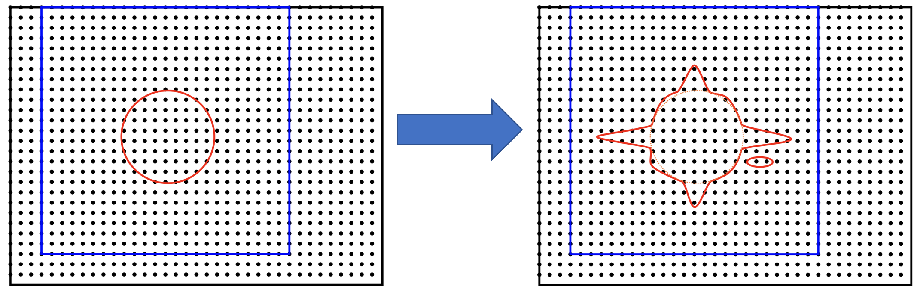
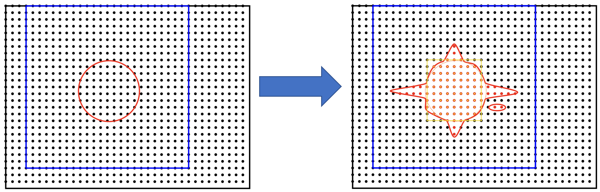
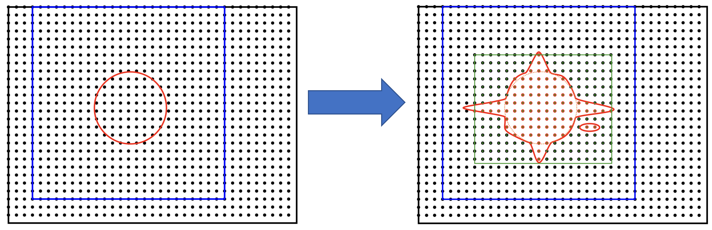
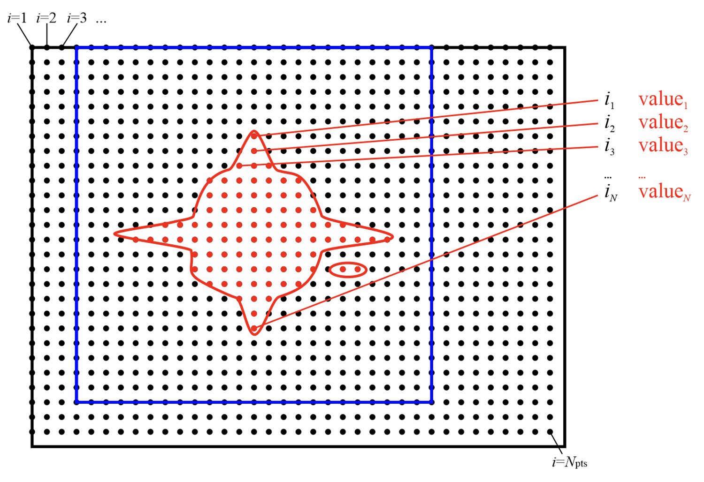
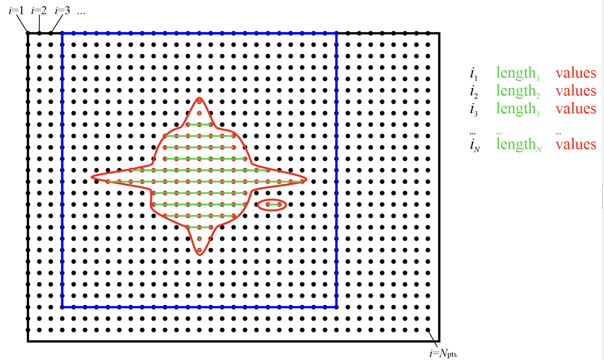
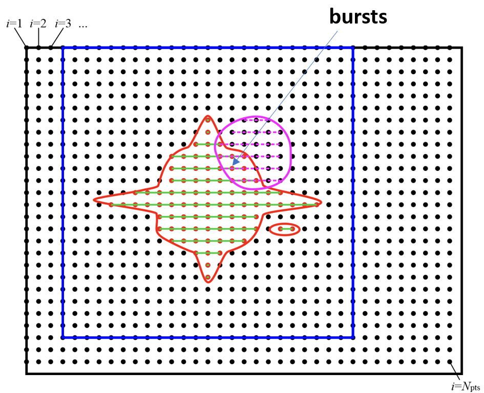
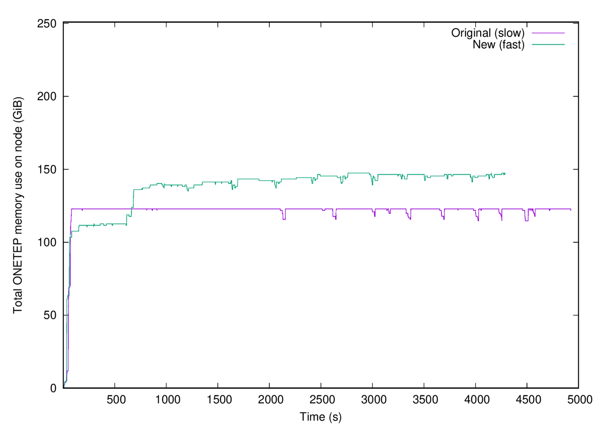
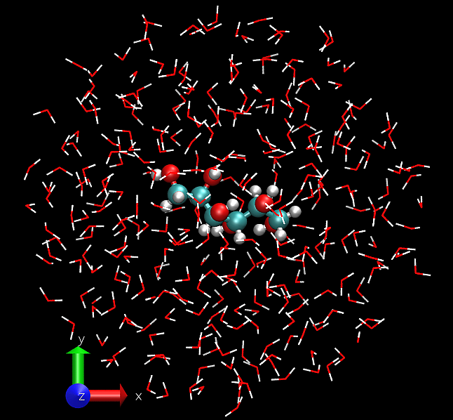
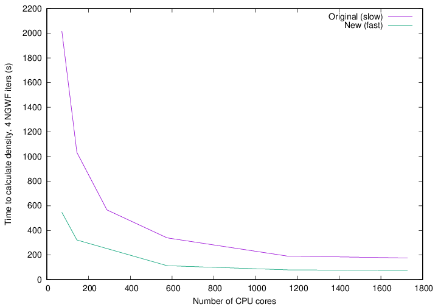
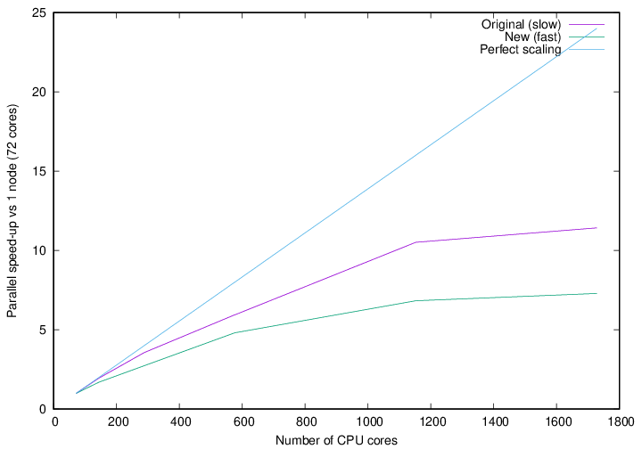

==============
Developer Area
==============

:Author: Jacek Dziedzic, University of Southampton
:Author: James C. Womack, University of Southampton
:Author: Nicholas Hine, University of Warwick

.. _dev_code_quality:

Advice for Contributors
=======================

.. _dev_pre_pull:

Pre-pull-request checks
-----------------------

The ONETEP source code is distributed with a number of useful scripts for
checking some aspects of the correctness of source code. Before creating a
pull request, you should ensure that these tests all pass for the branch you
want to merge in your private fork:

  1. **Check module dependencies** and a few other common issues. Run
     ::

       make checkdeps

     or, equivalently,

     ::

       ./utils/check_dependencies

     in the root directory of the repository. If any errors are found, fix them.

  2. **Check whitespace**. Run
     ::

       ./utils/check_whitespace

     in the root directory of the repository. This script can automatically fix
     whitespace issues -- see the output of ``./utils/check_whitespace -h`` for
     details.

  3. **Check use clauses**. Run
     ::

       ./utils/check_use_clauses src/yourmodule_mod.F90

     in the root directory of the repository, replacing ``yourmodule`` with the
     module you worked on. If there was more than one, do this for every module
     separately. This script checks for unnecessary
     use clauses and will help point them out. You are only responsible for the
     use clauses in the code you touched.

  4. You must also run the full QC test suite before creating a pull request.
     Instructions for that can be found here: :ref:`starting_compiling`.

|

Key points about running the QC test suite before creating a pull request:
  * Never run the QC tests in the actual repository. Create a copy of your
    ONETEP installation directory (e.g. ``cp -a onetep_jd onetep_jd_qc``) and
    run the tests in the directory of the copy. Much of the stuff in the install
    is not needed to run the tests (e.g. all of ``src/``), but it's just less
    hassle to copy the entire thing than pick out the necessary subdirectories.

    Why not run the QC tests in the actual repository? Because they produce
    outputs, which can become messy to clean up back to pristine state,
    polluting your repository with spurious changes. This becomes more
    problematic because symbolic links are used in the QC test suite. Trying
    to update your repository via ``git pull`` or ``git fetch`` may be
    tricky when you have unfinished or improperly cleaned up QC tests. Just
    don't run them straight in the repository.

   * You should run the test suite with ONETEP compiled with a recent version of
     a widely used Fortran compiler, e.g. GNU Fortran, Intel Fortran Classic,
     Cray Fortran.

   * The tests should be run in a parallel environment (ONETEP must be compiled
     with MPI support), ideally also making use of OpenMP threading (set the
     environment variable ``OMP_NUM_THREADS`` to a value >1, or use the ``-t``
     argument to ``onetep_launcher``).

   * No tests should fail, though warnings are acceptable.

If tests fail, please investigate this further before creating your pull request:
  * If you updated your local copy (``git merge`` or ``git pull``) rather than
    cloning it from scratch (``git clone``), did you remember to ``make cleanall``
    before compiling?
  * Check out the master branch from the official repository (ensuring that it is
    fully updated by fetching from it and merging) and run the failing tests on
    this.
  * If the relevant tests do not fail upstream (i.e. for the master branch on
    the official repository), you should fix the code in your fork before
    creating your pull request.
  * If the relevant tests also fail upstream, please check the
    list of issues in the official repository (
    https://bitbucket.org/onetep/onetep/issues, soon to move to
    https://github.com/onetep-devel/onetep/issues): there should be an open
    issue with relevant information. If such an issue has not been reported,
    please create a new issue explaining which tests are failing and any
    details about how the failures occur.

If the tests are not failing upstream, the problem is likely to be part of the
changes you have implemented and you will be the best person to find it and fix
it. If you need help, and want to discuss the issue with other developers, you
may create an issue in your fork (not in the official repository) and draw
their attention to it via email or on the ONETEP development Slack at
https://onetep-devel.slack.com/.

If your tests fail in a way in which the official master branch is known to
fail, your pull request may be acceptable -- you can go ahead creating the
pull request, but make sure that the text of the pull request includes a list
of the tests that fail and why you think that this is not a problem.

Ensure that the ONETEP version number in your
``src/onetep.F90`` file is updated appropriately (see
:ref:`dev_version_numbering` for a description
of ONETEP's version numbering system). If multiple pull requests are open, or
it takes time to merge your pull request, it may be necessary to update the
version number again during the pull request code review. This is to
ensure that the version number increments linearly in the official
repository's ``master`` branch.

Read the next subsection on style conventions to ensure your code adheres to
them.

.. _dev_style_conventions:

Style conventions
-----------------

In order to keep the ONETEP codebase relatively consistent and readable,
we have adopted the following conventions:

* Each line of code should be 80 columns or fewer in length, as this makes
  comparison of two versions of code side-by-side easier (some older code does
  not adhere to this, but all new code should).
* If a line exceeds 80 columns in length, use continuation characters (``&``)
  to break it into chunks of <=80 characters (remember to include an extra
  ``&`` at the beginning of the following line when breaking in the middle
  of a string literal). Do not add ``&`` in the next line otherwise,
  it's unnecessary.
* Always use spaces for indentation, never tabs.
* The blocks in the ``do`` loop, ``select case`` (also ``select type``) and
  ``if`` constructs should be indented by **3 spaces**.
* The contents of subroutines and functions should be indented by **2 spaces**.
  Use further 2 spaces for internals.
* Line continuations should be indented by **5 spaces** for continued lines.
* Ensure there is no trailing whitespace before you commit (you can use
  the ``./utils/check_whitespace`` script described in :ref:`dev_pre_pull`
  to check this).
* In general, adding or removing blank lines should be avoided in core modules,
  as these changes will appear in the commit history.

.. _dev_new_functionality:

New functionality
-----------------

If you add new procedures or significantly change existing procedures,
**you must create or update the documentation in the source code**.
Examples of how to document procedures can be found in the template module
``template_mod.F90`` in the ``doc`` directory. The key components of the
documentation of procedures are:

* A human-readable description of the new functionality.
* A list of the arguments and a description of their meaning.
* The author(s) and a changelog describing significant modifications.

When adding new functionality which does not fit into other modules, it may
be necessary to create a new source file containing a new module. Note that
procedures and variables should always be encapsulated in modules, not 'bare'
in a source file.

Before creating a new module, you should consider carefully whether your
new functionality fits within the framework of an existing module, or is
generic enough to be part of a multi-purpose module, such as `utils` or
``services``. If a new module is needed to encapsulate some new functionality,
then you should follow the following guidelines:

* Give your module a name which indicates the functionality it contains.
  If unsure, consult a more experienced developer to discuss an appropriate name.
* The filename for the module should have the form ``<module_name>_mod.F90``,
  where ``<module_name>`` is the name you have given the module.
* By default, variables and procedures in your module should be private (i.e.
  they should have the ``private`` attribute).
* Global module-wide variables (private or public variables declared at the
  level of the module itself rather than within its routines) constitute
  "hidden state", which tends to make the behaviour of a routine undesirably
  dependent on more than just the arguments it is called with. Sometimes these
  are unavoidable, and there are instances of them in the code. However, they
  should be minimised as much as possible. Think carefully before declaring any
  module-level global variables. More experienced developers may be able to
  suggest ways to encapsulate data inside arguments to routines such that they
  do not constitute "hidden state".
* Variables and procedures which do have to be public (accessible outside the
  module) should be explicitly specified (i.e. they should have the ``public`` a
  ttribute).
* In general, public variable and procedure names should be prepended by a
  standard prefix (typically the module name, or a shortened version of the
  name).

It is recommended that you make a copy of ``./doc/template_mod.F90`` and use
this as a starting point for your new module, as this will make following the
above guidelines easier.

.. _dev_version_numbering:

Version numbering
-----------------

There are three parts to the version number, both for development versions and
release versions. The first version number is only very rarely incremented by a
collective decision of the main authors of the code (ODG). New major versions
are released around every 6-12 months and are indicated by incrementing the
second number in the full version number (e.g. "2" in "4.2").

The major version number (second number in full version number) indicates
whether the associated source code is a release version or a development
version:

* Release versions (which are distributed to users) have an *even*
  second number.
* Development versions (which are under active development) have an *odd*
  second number.

Within a series with the same second version number, successive versions
(indicated by the third number in the full version number) should be compilable
and complete with respect to a given new feature.

For minor changes in development versions (e.g. a bugfix or minor change to
existing code), we no longer increment the fourth number (which is now absent
altogether) to avoid merge conflicts when this is done by multiple people.
The script ``utils/embed_version_info_in_banner`` ensures that pertinent
details of the local repository (branch, remote, last commit ID, list of
locally modified files) are included in the ONETEP banner during compilation,
but they do not go into the repository. Major changes (e.g. a new module or
overhaul of existing functionality) should increment the third number.

Bugfixes to a release version (merged into the corresponding release branch on
the official repository, e.g. `academic_release_v5.0`) should increment the
last (third) number in the full release version number.

**At any given time, there is a development version and a release version
differing in their second version number by 1.**

  * 4.0.0   <-- first release of v4
  * 4.0.1   <-- bugfix to v4 in git branch for release
  * 4.1.0   <-- first development version of v4 (initially same as 4.0.0)
  * 4.1.0   <-- minor development work (changes will be summarised in banner)
  * 4.1.1   <-- significant development work
  * 4.2 RC3 <-- release candidate 3 for v4.2
  * 4.2.0   <-- next release version
  * 4.3.0   <-- next development version (initially same as 4.2.0).
  * 5.0.0   <-- first release of v5

.. _dev_preventing:

Preventing accidental pushes to the official repository
=======================================================

* GitHub users in the *Owner* role of the ONETEP repository have write access
  to the official repository.
* *Owners* may want to take steps to avoid accidentally pushing work to the
  official repository if they have added this as a remote to their private fork.
* This can be achieved by setting the push address for the remote to an
  unresolvable URL, e.g.:
  ::

    git remote set-url --push github_official DISABLE

.. _dev_fast_density:

Fast density calculation (for developers)
=========================================

This section describes the "fast density" approach introduced in ONETEP 7.1.8 in January 2024.
This is developer-oriented material -- for a user manual, see :ref:`user_fast_density`.

We focus on the calculation on the double grid. If ``fine_grid_scale`` is different from 2.0,
the density gets interpolated from the double to the fine grid, regardless of the approach
for calculating the density on the double grid.

*A* denotes atoms local to a process. *B* denotes atoms that S-overlap with atoms *A*, they
are, in general, not local. NGWFs on *A* are indexed with *a*, NGWFs on *B* are indexed with *b*,
and so *Aa* and *Bb* can be used to index NGWFs globally. NGWFs *Aa* are local, NGWFs *Bb* are,
in general, not. Depending on who you ask, *Aa* NGWFs are sometimes termed "col", "ket" or "right";
*Bb* NGWFs are sometimes termed "row", "bra" or "left".

The usual ("slow") method for calculating electronic density in ONETEP proceeds as follows:

::

  // slow density
  for all local atoms A {
    dens_A = 0
    for all NGWFs a on A {
      (1) Transfer \phi_Aa to FFT-box.
      (2) Calculate \rowsum_Aa = sum_\Bb K^Aa,Bb \phi_Bb in FFT-box.
      (3) FFT-interpolate \phi_Aa and \rowsum_Aa to a double FFT-box.
      (4) Multiply dens_Aa = \phi_Aa * \rowsum_Aa in double FFT-box.
      (5) dens_A += dens_Aa.
    }
    (6) Deposit box containing dens_A to double grid.
  }

All ``\phi_Aa`` are local, so are ``K^Aa,Bb``. Stage (2) involves comms of ``\phi_Bb`` in PPDs via ``function_ops``.
Stage (6) involves comms of atom-densities ``dens_A`` via ``cell_grid_deposit_box()``. The algorithm proceeds in
batches (to conserve memory), and is OMP-parallelised. Comms must those be perofmed carefully, are done from ``$OMP MASTER`` regions in 
``function_ops_sum_fftbox_batch()`` and ``$OMP CRITICAL`` in ``density_batch_interp_deposit()``.

The number of FFTs done is :math:`2 N_{\textrm{NGWF}} N_{\textrm{outer}} N_{\textrm{inner}}`, where :math:`N_{\textrm{NGWF}}` is the
number of NGWFs in the system, :math:`N_{\textrm{outer}}` is the number of outer (NGWF) loop iterations, :math:`N_{\textrm{inner}}`
is the number of inner (LNV, EDFT) iterations. We ignore line searches in this estimate for simplicity. In practice real FFTs are done in pairs
throught a complex FFT, but we ignore this for simplicity.

The main drawbacks of this approach are:
  1. Having to repeat FFTs on ``\phi_Aa`` in the inner loop, even though they do not change.
  2. Having to repeat FFTs on ``\rowsum_Aa`` in the inner loop, because ``K^Aa,Bb`` changes.
  3. Interspersing comms with calculation in ``function_ops_sum_fftbox_batch()``, which makes GPU-porting difficult, and comms tricky.
  4. Having to calculate products of ``\phi_Aa`` and ``\phi_Bb`` in double FFT-boxes, even though "what matters" is 
     almost exclusively contained in the double tight-box of ``\phi_Aa``. We need to do the whole double FFT-boxes 
     because of Fourier ringing from the interpolation.
  5. Multiple depositions (and comms) to the same points in (6), because boxes of nearby *A* overlap.

(1) cannot be addressed directly by storing the interpolated ``\phi_Aa`` for the duration of the inner loop, because we
cannot afford to store full double FFT-boxes.

The fast density approach hinges on the fact that we can get sufficient accuracy even if we restrict ourselves to a subset
of the interpolated points in the double FFT-boxes. It turns out that only ~1-5% of the points in the double FFT-box are
needed to recover 99.9999-99.999999% of the charge of the NGWF (which is one electron). This approach is, thus, an
approximation, but it is well-controllable.

By using only a fraction of the points in the double FFT-boxes, we are able to store the interpolated NGWFs. This lets
us address (1) directly -- we only interpolate ``\phi_Aa`` at the beginning of the inner loop, and can now afford to
store the interpolated versions.

We address (2) and (3) by first interpolating only ``\phi_Aa``, and then communicating them to where they are needed
(and where they become ``\phi_Bb``). We use ``remote_mod`` for that, which separates the comms from the FFTs. Of course
we only communicate the relevant points, not the entire double FFT-boxes. Thus, we longer have to interpolate
``sum_\Bb K^Aa, \phi_Bb``, and we avoid doing FFTs in the
inner loop entirely. The number of FFTs is now :math:`N_{\textrm{NGWF}} N_{\textrm{outer}}` (we interpolate all NGWFs
every time they change), which saves 1-2 orders of magnitude in the number of FFTs. There is a price to pay, though:
we need memory to store the interpolated NGWFs, we have to communicate interpolated NGWFs rather than coarse-grid PPDs, 
and we need to do \sum_\Bb K^Aa,B \phi_Bb on the new representation somehow. If the latter can be done efficiently,
we are addressing (4) above, too.

.. _Figure fig:fast_density_spill:

   "Spilling" of an NGWF due to Fourier interpolation. Left panel -- NGWF (red) in an FFT-box (blue) on the coarse
   grid in the simulation cell (black). Right panel -- NGWF (red) in a double FFT-box (blue) on the double grid
   in the simulation cell (black). **The grid on the right is twice as fine** (not shown). The orange dashed line
   shows the original shape of the NGWF.

The main question is how to store and manipulate interpolated NGWFs accurately and efficiently, that is, how to
store and manipulate the points encompassed by a chosen isoline (red) in :numref:`Figure fig:fast_density_spill`, right panel.
The region of interest does not have to be contiguous.

.. _Figure fig:fast_density_tightbox:

   Storing only the points in the double tight-box (shown in orange) is not sufficiently accurate. Some points
   that matter are contained in the Fourier ringing that is outside the tight-box.
   
The naive approach of storing just the points in the "double tight-box" of the NGWF (as shown :numref:`Figure fig:fast_density_tightbox`)
turns out to be almost sufficiently accurate, but not quite, to get convergence to default RMS thresholds.
It's also not controllable.

.. _Figure fig:fast_density_geombox:

   Storing all the points in a box that covers an isoline is impractical, because the Fourier ringing extends far
   along the box axes, and we wind up storing points that are irrelevant (shown in green and not in red).

An alternative is to choose a threshold for the values of the NGWF and to construct the smallest cuboid 
(or actually a parallelepiped) that encompasses all those points, as shown :numref:`Figure fig:fast_density_geombox`.
This is controllable (via the threshold), but not very economical, because we store many more points than are
necessary. This is because the ringing extends almost exclusively along the axes of the cell, practically to the faces
of the double FFT-box. We'd like to keep this ringing, but not the points in the bulk of the double FFT-box.

.. _Figure fig:fast_density_trimmed_uncompressed:

   Storing "just the points we need", in a naive fashion, by storing *where* (linear indices on the double grid),
   and *what* (values). This automatically takes care of the non-contiguity of the data we want to store.

We can find which points we need (all points whose value is below a chosen threshold), and then remember their positions
and values, like shown in :numref:`Figure fig:fast_density_trimmed_uncompressed`. For positions it is convenient to
use a linear index on the double grid -- this makes them absolute (rather than relative to the double FFT-box), and
permits handling PBCs at this stage.

Of course, such indexed approach is inefficient. Manipulating this representation is slow, and it takes more space than
needed -- we need to store an integer index in addition to every double precision value. However, we can exploit the
fact that much of the region of interest is contiguous. This lets us proceed with a run-length encoding, as shown
in :numref:`Figure fig:fast_density_trimmed_compressed` -- we can store *starting positions*, *run lengths* (counts),
and *values*.

.. _Figure fig:fast_density_trimmed_compressed:

   Storing "just the points we need", using RLE compression, by storing *where* (linear indices on the double grid),
   *how many* (run lengths) and *what* (values). This automatically takes care of the non-contiguity of the data we want to store,
   but is efficient. Note that there are, in general, multiple values (red) for every *run* (shown in green).

For typical thresholds, the average run length is about 30. That means we only have to store two integers for every 30 double
precision real values, so the overhead is minimal. Recall that we only keep 1-5% of the points in the double FFT-box, which
means we can afford storing and communicating such *compressed trimmed NGWFs*. As will be shown later, manipulating them
can also be done efficiently.

Recall that we are interested in calculating *products* of such NGWFs, and this has to be done in the inner loop, because even
if we can afford to store interpolated NGWFs, we cannot afford to store entire products, there's just too many of these. However,
we can store information on which parts of the NGWFs overlap, which boils down to determining which runs in ``\phi_Aa`` overlap
where with which runs in ``\phi_Bb`` and by how much. These overlaps are the *bursts* in which we will calculate sums and products
later.

.. _Figure fig:fast_density_trimmed_bursts:

   To calculate the product between two compressed trimmed NGWFs, we first determine *bursts*, i.e. the overlaps between runs
   of NGWF *Aa* (green) and runs of NGWF *Bb* (magenta). Bursts are shown as green-magenta dashes.

The bursts can be determined outside of the inner loop and stored. Bursts do not store any information on the values, only
start and end indices to the values in ``\phi_Aa`` and ``\phi_Bb``. Using this information we can calculate ``\sum_\Bb K^Aa,B \phi_Bb``
more efficiently in the inner loop.

The fast density approach thus proceeds in two stages -- one that is performed every time NGWFs change, and one that is performed
in the inner loop. In pseudocode they look as follows:

::

  // density_fast_new_ngwfs():
  OMP for all local NGWFs Aa {
    (1) FFT-interpolate \phi_Aa to a double FFT-box.   } Happens in
    (2) Trim the data in double FFT-box, RLE-compress. } density_fast_interp_ngwfs().
    (3) Pack the result in an array of doubles.        }
  }
  (4) Communicate the necessary trimmed Bb NGWFs from remote ranks
      via remote_comm_trimmed_ngwfs_of_neighbours().
  (5) Determine product bursts via trimmed_ngwfs_prepare_bursts():
      for all local NGWFs Aa {
        OMP for all atoms B that overlap with A {
           for all NGWFs b on B {
             Determine bursts between Aa and Bb.
           }
        }
      }

Only stage (4) involves MPI comms.

The density-kernel-dependent stage that needs to be done inside the inner loop looks like this:

::

  // density_on_dbl_grid_fast():
  for all local NGWFs Aa {
    accum_Aa = 0
    (1) OMP for all Bb that overlap Aa {
          (2) Accumulate rowsum_A = K^AaBb \phi_Bb using bursts.
        }
    (3) Deposit \phi_Aa * rowsum_A to a proc-local double grid.
  }
  (4) Flatten proc-local double grids to usual distributed representation.

Only stage (4) involves MPI comms.

Typical speed-ups obtained using this approach range from 2x to 6x for the total time spent
calculating the density, and between 10% and 50% can be shaved off the total calculation walltime.

The main drawback of this approach is increased memory consumption. There are two main components:
  (A) The trimmed NGWF data itself, which is, to a large extent, replicated. A single trimmed 
      NGWF can be needed on many processes, because it could be a ``\phi_Bb`` to many NGWFs Aa.
      Moreover, this memory requirement does not scale inverse-linearly with the number of processes.
      That is, increasing the node count by a factor of two doesn't reduce the memory requirement
      by a factor of two, because there is more replication.
  (B) The burst data.

Both (A) and (B) depend on the trimming threshold, and the shape of the NGWFs. Both tend to increase
during the NGWF optimisation as the NGWFs delocalise somewhat.

A typical plot of the memory used by both approaches is shown in :numref:`Figure fig:fast_density_mem_use`.
For this calculation the slow approach took 1893s (33.3% of the total walltime), and the fast approach
took 727s (14.8% of total walltime), for a speed-up of 2.6x. One-eighth of the total walltime was
shaved off. Of the 727s only 66s were spent doing FFTs.

.. _Figure fig:fast_density_mem_use:

   Memory used by the slow approach (magenta) and the new approach (cyan) for a calculation on
   ethylene carbonate (4000 atoms) on 32 nodes of Archer2. 9 a0 NGWFs, 829 eV, EDFT. 117x117x117 FFT-box,
   140x140x140 cell. 16 OMP threads were used.

The accuracy of the fast density approach can be demonstrated on an example -- we consider the binding energy
of mannitol to 300 water molecules. The system is shown in :numref:`Figure fig:fast_density_mannitol`.

.. _Figure fig:fast_density_mannitol:

   Our testcase: mannitol bound to 300 water molecules (926 atoms). 811 eV KE cutoff, 9 a0 NGWFs, 8 LNV iterations.

I ran this testcase on 16 nodes of HSUper (8 processes on a node, with 9 threads each, saturating all 
72 CPU cores on a node) -- both the complex and the water shell. The mannitol itself was ran on 1 node,
because it's small. I used the default settings, only specifying `fast_density T`.

+-------------------------------+--------------+--------------+
| Quantity                      | Slow density | Fast density |
+===============================+==============+==============+
| Binding energy (kcal/mol)     | -79.9027     | -79.9014     |
+-------------------------------+--------------+--------------+
| Total walltime                | 1016s        | 718s (-29%)  |
+-------------------------------+--------------+--------------+
| Time to calculate density     | 520s         | 239s         |
+-------------------------------+--------------+--------------+
| Time spent doing FFTs         | 160s         | 23s          |
+-------------------------------+--------------+--------------+
| High-mem watermark on a node  | 55.6 GiB     | 69.7 GiB     |
+-------------------------------+--------------+--------------+

As seen from the above table, we are accurate to ~0.001 kcal/mol, while shaving off 29%
from the total walltime. The density calculation itself was faster by a factor of 2.2.

I also performed scaling tests, using a 701-atom protein scoop at 827 eV, 9a0 NGWFs, 8 LNV iterations.
I only ran it for 4 NGWF iterations because it's not properly terminated, which leads to a zero band-gap,
meaning it cannot be reliably converged to default thresholds (with either density method). These were
run on different numbers of nodes of HSUper, with 8 processes and 9 OMP threads per node.

.. _Figure fig:fast_density_scoop_walltime:

   Time to calculate density in 4 NGWF iterations of a 701-atom protein scoop.

.. _Figure fig:fast_density_scoop_scaling:

   Strong parallel scaling of the two methods of calculating the density in for a 701-atom protein scoop.

:numref:`Figure fig:fast_density_scoop_walltime` shows the walltime of the density calculation for the
slow and fast approaches, while :numref:`Figure fig:fast_density_scoop_scaling` shows the strong scaling
with respect to one node. It is clear that the fast approach is quite a bit faster than the original
approach, although it does not scale that well to high core counts. Keep in mind that we pushed this
system quite far by running 701 atoms on over 1600 CPU cores.

Directions for improvement
--------------------------

This approach could be improved in a number of ways:
  1. Setting up an allowance for used RAM, similarly to what is done in HFx. This would enable
     graceful performance degradation in low-memory scenarios. This could be achieved by not
     storing all the bursts, only those that fit within the allowance. The remaining bursts
     would have to be recalculated on the fly in the inner loop.
  2. Making it compatible with EMFT, complex NGWFs and mixed bases.
  3. Adding an ``$OMP SCHEDULE`` toggle between ``STATIC`` and ``DYNAMIC`` in ``density_on_dbl_grid_fast()``
     for more control over determinism vs efficiency. Currently we use ``SCHEDULE(STATIC)`` to get
     more deterministic results, but ``SCHEDULE(DYNAMIC)`` offers better efficiency. Toggling this
     at runtime is not trivial (``omp_set_schedule()``).
  4. Having a dynamic `fast_density_trim_threshold` -- we could probably start the NGWF optimisation 
     with a cruder approximation, tightening it as we go along.
  5. Dynamically selecting ``MAX_TNGWF_SIZE``. It's currently a constant, and ``persistent_packed_tngwf``
     is not an allocatable.
  6. A smarter way to flatten the computed density. Currently each process has their own density that
     spans the entire cell and only contains contributions from the *Aa* NGWF it owns. We flatten it
     by a series of reduce operations over all nodes. This is the main killer of parallel performance.
  7. We should also consider a more FFT-heavy approach in which we only FFT-interpolate local (*Aa*)
     NGWFs, but communicate *Bb* on the coarse grid, in PPDs. Then we'd use the latter to build ``rowsum_Aa`` in FFT-boxes,
     just like in the old scheme (except with the comms done in advance) in the kernel-dependent
     stage. These would be then FFT-interpolated like in the old scheme, but then trimmed and the
     rest would proceed like in the fast scheme. This approach would conserve memory (no storing of individual
     trimmed Bb's, only ``rowsum_Aa``'s, ditto for bursts), and do fewer comms (communicating NGWFs in
     PPDs via ``remote_comm_ngwfs_of_neighbours()``). There would fewer burst ops, because we'd be dealing
     with entire rowsums instead of individual *Bb*. But we would be repeating FFTs in the inner loop.

.. _dev_history:

History
=======

The earliest versions of the code, dating back to before 2005, were committed
to a revision control system based on CVS. These files are still available on
the TCM filesystem at /u/fs1/onestep/CVS_REPOSITORY. In around 2009 we moved
to Subversion, using a repository still hosted on the TCM filesystem in
Cambridge. The SVN history was migrated to Bitbucket, and subsequently to
GitHub (2023) and can still be browsed within the current Git repository
(though attribution to authors is often not correctly recorded).

In June 2018, the ONETEP project was migrated from a Subversion repository to a
Git repository. The hosting of source code was simultaneously moved
from cvs.tcm.phy.cam.ac.uk to Bitbucket.

In July 2023, the ONETEP project was migrated from Bitbucket to GitHub.
