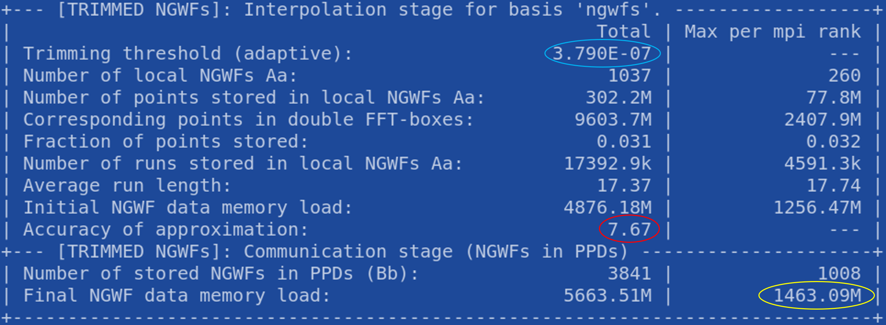

==========================
Performance considerations
==========================

:Author: Jacek Dziedzic, University of Southampton

How quickly ONETEP runs your calculations depends on a number of factors.
Choosing the number of nodes, processes and threads has already been described in :ref:`running_parallel`.

Here we mention techniques that can be used in addition to an efficient parallel decomposition to improve performance.

.. _user_fast_sparse_to_dense:

Fast sparse-to-dense and dense-to-sparse conversions
====================================================

In many scenarios, ensemble DFT calculations being a notable example, ONETEP needs to convert between two matrix
representations -- a distributed sparse one ("SPAM3"), and a distributed dense one ("BLACS"). These conversions
happen multiple (hundreds) times in a run, and involve substantial data communication. There are two ways in
which ONETEP can do these -- conveniently termed "slow" and "fast".

The slow approach is the only approach available until ONETEP 6.1.21. Starting from ONETEP 6.1.22, a fast approach
is also available, *and is the default*. This means that no action is required on your part to use the fast approach.
The fast approach is up to several times faster (for this part of the calculation).

You can check which approach you are using by examining the timings printed out at the end of your calculation
(provided you are not using ``timings_level 0``). If your timings include ``sparse_spam3toblacs_real_fast`` and
``sparse_blacstospam3_real_fast`` -- you are using the fast approach. If instead you have ``sparse_spam3toblacs_real_slow``
and ``sparse_blacstospam3_real_slow`` -- you are using the slow approach.

To switch between the approaches use:
  - ``fast_dense_to_sparse T`` and ``fast_sparse_to_dense T`` -- for the fast approach,
  - ``fast_dense_to_sparse F`` and ``fast_sparse_to_dense F`` -- for the slow approach.

The fast approach is currently incompatible with the image comms subsystem needed by NEB. This means you cannot
use the fast approach with NEB. Please add ``fast_dense_to_sparse F`` and ``fast_sparse_to_dense F`` to your input
file when using NEB.

.. _user_fast_density:

Fast density calculation (for users)
====================================

This is a user-level explanation -- for developer-oriented material, see :ref:`dev_fast_density`.
All of the text below applies to ONETEP 7.3.53 and later. Certain subsets of the functionality
described below have been available earlier (starting from 7.1.8), but some things, including defaults,
changed in the meantime. **Make sure you are using ONETEP 7.3.53 or later.**

Calculating the electronic charge density is one of the more time-consuming operations in ONETEP. In a typical
calculation it has to be performed hundreds of times. There are two ways in which ONETEP can calculate the density
-- conveniently termed "slow" and "fast".

The slow approach is the only approach available until ONETEP 7.1.7.
Starting with ONETEP 7.1.8, a fast approach is also available, *but it is not the default*.
This means that action is required on your part to use the fast approach.
The fast approach is up to several times faster, (for this part of the calculation),
and up to 15 times faster when running on a GPU,
but that depends heavily on the system. It does require more memory.

**The fast approach works best for "serious" systems, it's not meant to address
scenarios with KE cutoffs below 700-800 eV or NGWFs smaller than 8.0 a0. It will
also not perform well when your FFT-box is small (say, below 80 x 80 x 80 points),
as happens e.g. for very small periodic supercells. In this case it can actually be slower.**

To switch between the approaches use:
  - ``fast_density T`` -- for the fast approach,
  - ``fast_density F`` -- for the slow approach.

Be aware that the fast approach *is an approximation*. The approximation is well-controllable,
which means you can get as close with the accuracy to the slow (exact) approach as you
like, albeit sacrificing performance as you do so.
Conversely, you can make the fast approach as fast as you like, but you will be
sacrificing accuracy, up to a point of making your results worthless.
This means care must be taken when changing the parameters of this approach --
non-expert users are advised to use the defaults, or even "safe settings" described below.

Starting from ONETEP 7.3.53 there are actually *two* different fast density
methods implemented. They offer the practically same accuracy for the same
settings (see below), but employ different tradeoffs between memory use and
performance. As a user, about the only thing you need to know is:

- ``fast_density_method 1`` is usually the fastest, but requires the most memory,
- ``fast_density_method 2`` is usually somewhat slower than method 1, but still much faster
  than the slow (default) calculation. It has two important advantages --
  **it uses much less memory than** ``fast_density_method 1``, **and it has been
  GPU ported**. If you are running on GPUs, you should be definitely using this
  option.

The default (once you specified ``fast_density T``) is ``fast_density_method 2`` (starting from ONETEP 7.3.53).

You can check which approach you are using by examining the timings printed out
at the end of your calculation
(provided you are not using ``timings_level 0``). If your timings include
``density_fast_new_ngwfs`` -- you are using one of the fast approaches. If instead you
have ``density_on_dbl_grid`` and ``density_batch_interp_deposit`` -- you are
using the slow approach.

The main idea behind the fast density approach is *trimming* interpolated NGWFs, that is, ignoring the points
whose (absolute) values are below a prescribed threshold. The value of this threshold, set by ``trimmed_boxes_threshold``
is the main parameter controlling the balance between accuracy and efficiency.
This parameter is independent of NGWF radii. It also already includes grid weights,
so you *do not* need to adjust it when changing ``psinc_spacing`` or ``cutoff_energy``.

Since this is possibly the only parameter worth adjusting,
here's a more detailed description.

*Positive* values of ``trimmed_boxes_threshold`` define the threshold below which NGWF values on the double
grid are ignored ("trimmed"). A reasonable value is ``1E-6``, which should not interfere with NGWF convergence
to the default RMS gradient thresholds (which is ``ngwf_threshold_orig 2E-6``). If you need to converge tighter (this can happen
e.g. when you set ``elec_energy_tol``), consider reducing this value to get more accuracy -- e.g. to ``5E-7``
or ``2E-7`` (this is already very tight). You probably don't want to decrease the threshold below ``1E-7``.
To make your calculation faster, increase the threshold -- probably not above ``1E-5``.

A *negative* value of ``trimmed_boxes_threshold`` turns on *adaptive thresholding* -- the threshold will start
at ``1E-5`` (or ``8E-7`` when restarting) and will progressively decrease during NGWF convergence. 
A value of ``-1.0`` will set the threshold to a *quarter of the numerical value of the NGWF RMS gradient*, 
but never larger than ``1E-5`` (or ``8E-7`` when restarting). In practice, this
means you'll start at ``1E-5`` (or ``8E-7`` when restarting) for the first few iterations, and then as your NGWF RMS gradient goes down,
so will the threshold. The tighter you want to converge your NGWFs, the tighter the threshold will become.
This frees you from worrying about this parameter. Starting from ONETEP 7.3.40, ``-1.0`` is the default if you
are optimising NGWFs. If ``maxit_ngwf_cg`` is non-positive (implying fixed NGWFs), ``1E-6`` is used instead --
there is nothing to adapt between NGWF steps, because there are no NGWF steps then.

A different starting value for restarted calculations ensures we never start close to convergence with a crude threshold.

In the unlikely case where you'd want to keep adaptive thresholding but control how it is coupled to the NGWF
RMS gradient, you can choose a different *negative* value. ``-0.5`` will make the threshold equal to an *eighth
of the numerical value of the NGWF RMS gradient*, ``-2.0`` to a half, and so on. The cap always remains at ``1E-5``.

If you use ``trimmed_boxes_output_detail VERBOSE`` (or higher), ONETEP will print out a summary of the approximation
every time NGWFs change. It will look similar to :numref:`Figure fig:fast_density_info`. This includes the current
value of the trimming threshold (first line), and the quality of the approximation (*accuracy of approximation*).
The latter tells you to how many digits the approximated NGWF charge is equal
to the exact (double FFT-box) NGWF charge, in the root-mean-square sense over all NGWFs in the system. In this
example our approximated charge is no further from 1.0 (a correctly normalized NGWF) than ~1E-8.

As your calculation progresses, this value will fluctuate, and is likely go down slightly, as the NGWFs become
more diffuse. As a rule of thumb, if it gets below 5.0-6.0, you will have difficulty converging NGWFs to the
default threshold. If it is above 9.0, you are probably using too much accuracy, losing efficiency as you do that.

.. _Figure fig:fast_density_info:

   The summary printed by fast density every time the NGWFs change. Of main interest are: *accuracy of approximation* (shown
   in red) and *estimated high-memory watermark per MPI rank* (shown in yellow).

Another notable quantity in :numref:`Figure fig:fast_density_info` shown in the last line. Depending on method,
it can be called *Final NGWF data memory load* or *estimated high-memory watermark per MPI rank*. It's shown here in yellow.
This is a reminder that the fast density approach uses significantly more memory than the slow approach.
The value in the printout is the expected *maximum* memory that fast density uses *per MPI rank*. If your printout is
truncated before you reached this line, you most likely already ran out of memory. At this stage, we use an all-or-nothing
approach -- there is no way to give the algorithm a memory allowance and tell it that it should not consume more. Work on
this is in progress. The best way to reduce memory load is to use fewer processes per node and more threads. If this is
not sufficient, you can reduce the memory load by using more nodes, but this is not a linear dependence -- i.e. you will
*not* reduce the load by a factor of two if you add twice as many nodes. Note that what is printed out is the
amount of memory consumed by the fast density approach, not by all of ONETEP.

When is fast density used?
--------------------------

Fast density is only used for energy evaluations done from ``hamiltonian_mod`` -- via ``hamiltonian_lhxc_calculate()``
and ``hamiltonian_energy_components()``. These are the costly density calculations, because they are done hundreds
of times in the course of a calculation. All other density calculations (done in forces, properties, eigenstates,
linear response, lr_tddft, population, dma, dmft, EDA, implicit solvent restarts) are always done using the exact
(slow) method. The rationale is that these are done much less often and possibly require more accuracy.

If you want to know precisely when the fast and slow routines are called, specify ``trimmed_boxes_output_detail PROLIX``
or higher.

Accuracy
--------

The default settings should give you sufficient accuracy to converge NGWFs to any reasonable threshold and to get energies and
forces that are negligibly different from those obtained with the slow approach. However, for more difficult systems,
particularly if using low kinetic energy cutoffs (say, below 700 eV -- like would probably be used with PAW),
you might need to tighten the parameters to get desired accuracy.

In addition to adjusting ``trimmed_boxes_threshold`` as explained earlier, you may want to use
``fast_density_off_for_last T`` (the default is ``F``). This will tell ONETEP to use the slow (but exact) approach for
the final energy evaluation. You will know this happened by examining the output file and looking for:

::

  ! Looks like the last energy evaluation.
  ! The fast density calculation will now be disabled in the interest of accuracy.

Note that this will not be printed if ``trimmed_boxes_output_detail`` is ``BRIEF`` or if fast density would
have already been switched off by ``fast_density_elec_energy_tol`` (see below). This setting resets any time you start a new
NGWF convergence loop -- that means that in auto solvation, geometry optimisation, MD, etc. each optimisation will
start with fast density turned on.

Also note that this switching is done in the NGWF convergence loop. If you are working with fixed NGWFs
(``maxit_ngwf_cg 0`` (or negative)), this switching will not take place.

Furthermore, particularly if your calculation struggles to converge to the default
NGWF threshold, you can set ``fast_density_elec_energy_tol``. This is the energy change per atom between NGWF steps
below which ONETEP will switch to the slow (but exact) approach. It's the same quantity that is used as the energy
convergence criterion in ``elec_energy_tol``. The default is ``1E-50``, effectively turning this off. Setting it
to ``1E-7`` will typically have ONETEP switch to the slow approach for the last few NGWF iterations. The higher
you set this, the sooner ONETEP will switch to the slow approach. This, of course, eats into your efficiency gain.
You will know if and when this happened by examining the output file and looking for:

::

  ! Energy change per atom: 0.30287E-07 Eh < 0.10000E-06.
  ! The fast density calculation will now be disabled in the interest of accuracy.

Note that this will not be printed if ``trimmed_boxes_output_detail`` is ``BRIEF``. This setting resets any time
you start a new NGWF convergence loop -- that means that in auto solvation, geometry optimisation, MD, etc. each
optimisation will start with fast density turned on.

Note that you need at least two NGWF iterations to have a meaningful energy change to examine, so this setting
has no effect if you take fewer than two NGWF iterations.

.. _user_fast_density_memory_use:

Memory use
----------

Fast density requires more memory than slow density, particularly with ``fast_density_method 1``. Fortunately,
``fast_density_method 2`` requires substantially less memory. If you are running on GPUs, you might want to
control memory use more tightly, since GPUs typically have much less RAM available.

Keywords that might help you are:
  - ``fast_density_batch_size n`` -- which controls the batch size over FFTs in fast density. The default is 64.
    We need to keep a coarse-grid FFT-box for each element of the batch, both on the CPU and GPU (if in use),
    per MPI rank. This setting is not affected by the number of OpenMP threads. Reducing this value will decrease
    memory use both on the CPU and GPU. The lowest you can go is 1.
    You will likely experience a performance hit if you go below 16.
  - ``threads_gpu n`` -- which controls the number of OpenMP threads (on each MPI rank) driving GPU operations.
    We need to keep a complex coarse-grid FFT-box and a complex fine-grid FFT-box both on the CPU and the GPU (if in use),
    per each OpenMP thread per each MPI rank. This is for the OpenACC cuFFT backend, for the CUDA cuFFT backend the
    requirement is twice that much. This is a lot of RAM, particularly for a GPU. Reducing this setting should
    significantly reduce GPU memory use. The default is the same as ``threads_max``, and so is the same as
    what you pass in the ``-t`` option to ``onetep_launcher`` or set your ``OMP_NUM_THREADS`` to. You will likely
    experience a performance hit when decreasing it.
  - ``fast_density_fast_ngwfs T/F``. For more details, see :ref:`user_fast_ngwfs`.
    Setting to ``F`` will reduce memory use, particularly on the GPU. When running on CPU, you should be
    using ``F`` anyway, as there will likely be no performance gain from using ``T``. On GPUs ``T`` should be faster.
    The default is ``T`` when running on a GPU, and ``F`` otherwise.

Remaining options
-----------------

The default output detail of fast density is the same as specified for ``output_detail``. You can set it separately
by specifying ``trimmed_boxes_output_detail``. The available options are the same as for all ONETEP output details:
``BRIEF``, ``NORMAL``, ``VERBOSE``, ``PROLIX`` and ``MAXIMUM``.

Example settings
----------------

For a quick-and-dirty calculation (might not converge to default thresholds) use:
 - ``fast_density T``
 - ``trimmed_boxes_threshold 2E-5``.

For a typical calculation just use:
 - ``fast_density T`` (which will use the default of ``trimmed_boxes_threshold -1.0``
   for optimised NGWFs, or ``1E-6`` for fixed NGWFs).

For an accurate, but slower calculation use:
 - ``fast_density T``
 - ``trimmed_boxes_threshold 7E-7``
 - ``fast_density_off_for_last T``
 - ``fast_density_elec_energy_tol 1E-7``.

For very safe settings that should provide a modest gain in efficiency, try:
 - ``fast_density T``
 - ``trimmed_boxes_threshold 4E-7``
 - ``fast_density_off_for_last T``
 - ``fast_density_elec_energy_tol 3E-7``.

If you keep running out of memory, ensure you are not using``fast_density_method 1``.
Try ``fast_density_method 2`` instead. Read :ref:`user_fast_density_memory_use`.

If you are running ONETEP on GPUs, most definitely use ``fast_density_method 2``.

Compatibility
-------------

Fast density is known to work (to the best of our knowledge) with the following additional functionalities:
  - extended NGWFs,
  - PBCs and OBCs,
  - implicit solvation,
  - hybrid functionals and Hartree-Fock exchange,
  - ``fine_grid_scale`` larger than ``2.0``,
  - PAW,
  - DFT+U,
  - conduction,
  - MD,
  - geometry optimisation,
  - TS search,
  - NEB,
  - EDFT and LNV.

Fast density is known *not* to work (this we know with certainty) with the following additional functionalities:
  - complex NGWFs (and, thus, k-points),
  - spin-polarised NGWFs (but spin-polarised density kernel is compatible),
  - TD-DFT (mixed bases are not supported at this point).
  - EMFT (regions).

ONETEP will stop with an error if either of these is used with ``fast_density T``.

.. _user_fast_locpot_int:

Fast local potential integrals (for users)
==========================================

This is a user-level explanation -- for developer-oriented material, see :ref:`dev_fast_locpot_int`.

The calculation of local potential integrals is another time-consuming part of ONETEP.
In a typical calculation it has to be performed hundreds of times. There are two
ways in which ONETEP can calculate the local potential integrals -- conveniently termed "slow" and "fast".

The slow approach is the only approach available until ONETEP 7.1.49.
Starting with ONETEP 7.1.50, a fast approach is also available, *but it is not the default*.
This means that action is required on your part to use the fast approach.
The fast approach is up to several times faster (for this part of the calculation),
but that depends heavily on the system. It does require more memory.

The fast approach for local potential integrals uses similar techniques as :ref:`user_fast_density`,
that is *trimming* of data in double-grid FFT-boxes, which is a well-controllable approximation,
but an approximation nevertheless. It would be prudent to read the section on :ref:`user_fast_density`,
and the part about controlling accuracy in particular. The same mechanism is
used here (``trimmed_boxes_threshold``).

**The fast approach works best for "serious" systems, it's not meant to address
scenarios with KE cutoffs below 700-800 eV or NGWFs smaller than 8.0 a0. It will
also not perform well when your FFT-box is small (say, below 80 x 80 x 80 points),
as happens e.g. for very small periodic supercells. In this case it can actually be slower.**

To switch between the approaches use:
  - ``fast_locpot_int T`` -- for the fast approach,
  - ``fast_locpot_int F`` -- for the slow approach.

In contrast to fast density, there is only one fast locpot int approach implemented,
so there is no need to choose a method, just turning it on is sufficient.
The fast locpot int approach works best when `fast_density T` is in use (regardless of
`fast_density_method`), as they share some of the workload and memory requirement.
You can expect good synergy when using both approaches at the same time.

There is only one additional settings for fast local potential integrals at this point
(apart from ``trimmed_boxes_threshold``), and almost always simply turning
it on is sufficient. For pointers about about settings, see the suggested settings
in :ref:`user_fast_density`, just add `fast_locpot_int T` to any of them.

The additional setting is:
 - ``fast_locpot_int_fast_ngwfs T/F`` -- which turns *fast NGWFs* on or off in
   the calculation of local potential integrals. On a CPU these are expected
   to offer a marginal boost in performance. On a GPU the gain should be more
   significant. The default is ``T`` when running on a GPU, and ``F`` otherwise.

A GPU port of fast local potential integrals is in place (starting from ONETEP 7.1.50).
It is activated automatically if you run a GPU-capable binary.

.. _user_fast_ngwfs:

Fast NGWFs (for users)
======================

This is a user-level explanation -- for developer-oriented material,
see :ref:`dev_fast_ngwfs`.

This is an experimental feature at this point (February 2025).
The PPD representation of NGWFs in ONETEP can be replaced by a faster representation
known as the *rod* representation. This can be done with:

 - ``fast_density_fast_ngwfs T`` -- in the fast density calculation,
 - ``fast_locpot_int_fast_ngwfs T`` -- the fact local potential integral calculation,

or with:

 - ``fast_ngwfs T`` -- which over-rides both of the above to ``T``.

The default is ``fast_density_fast_ngwfs F`` and ``fast_locpot_int_fast_ngwfs F``
when running on a CPU, and ``fast_density_fast_ngwfs T`` and ``fast_locpot_int_fast_ngwfs T``
when running on a GPU.

On a CPU the performance gain will likely be marginal or non-existent. On a GPU
you should see a modest improvement. The memory cost of ``fast_locpot_int_fast_ngwfs T``
should be negligible on both CPU and GPU. The memory cost of ``fast_density_fast_ngwfs T``
is significant, particularly on a GPU.
