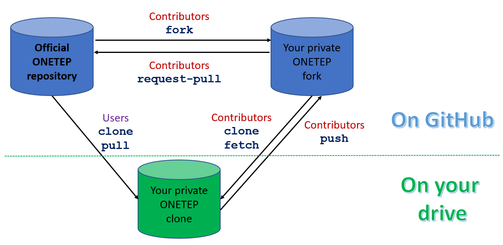

===================
Working with GitHub
===================

:Author: Jacek Dziedzic, University of Southampton
:Author: Nicholas Hine, University of Warwick
:Author: James C. Womack, University of Southampton

:Date: July 2023

.. _github:

This chapter describes a number of procedures for working with GitHub. These
are separate procedures, each performing a simple GitHub-related operation.
They are not meant to be invoked in numerical sequence.

.. _github_location:

Repository location and structure
=================================

The ONETEP GitHub repository is located at https://github.com/onetep-devel/.

``onetep-devel`` is the *organisation*. It contains four repositories (which
you can see by clicking ``Repositories`` at the top):

  1. ``documentation`` (public) -- containing the source of the documentation,
     for instance this document.
  2. ``tutorials`` (public) -- containing the source of the ONETEP tutorials.
  3. ``utils-devel`` (public) -- containing the utilities and resources that
     are not directly distributed with ONETEP, such as scripts, GFN parameters,
     vdW parameters, PAW datasets, and developer documentation.
  4. ``onetep`` (private) -- containing the ONETEP distribution itself, which
     is mostly Fortran source code (``src/``), quality-check tests
     (``tests/``) and utilities (``utils/``).

The ``onetep`` repository is private, so if you haven't been granted access to
it, you will only see *three* repositories at https://github.com/onetep-devel,
and trying to go directly to https://github.com/onetep-devel/onetep will give
you a *404 Page not found*.

.. _github_setup:

ONETEP GitHub set-up
====================

:numref:`Figure fig:github_setup` shows how the ONETEP workflow is set up
on GitHub and locally, on your drive.

.. _Figure fig:github_setup:

   Set-up of ONETEP on GitHub. There is one official repository. *Users* ``clone``
   the repository (once), and later ``pull`` if they want to update it with
   the latest changes. They cannot contribute.
   *Contributors* ``fork`` the repository first (once),
   then ``clone`` the fork (once), not the official repository.
   They ``fetch`` (and merge) from the fork when they want to update. When
   they want to contribute changes, *Contributors* ``push`` to their fork first, then
   submit a ``pull request`` from the fork to the official repository. No pushing
   to the official repository happens at any stage. All contributions happen
   via ``pull requests``.

.. _github_create:

Creating a GitHub user account
==============================

Go to https://github.com/signup and follow the instructions there. Use your
university or organisation email.

.. _github_pat:

Creating a GitHub *personal access token* (PAT)
===============================================

To be able to access the ONETEP repository via ``git``, you will need to
create a *personal access token* or PAT on GitHub. This is a
distinct password from the one you use to access the GitHub web
interface, it will only be used for accessing the repository through
``git`` -- the two passwords are not interchangeable. You must have a PAT set up,
you will not be able to access the ONETEP repository with your GitHub password.

For technical details, read https://docs.github.com/en/get-started/getting-started-with-git/about-remote-repositories#cloning-with-https-urls

To create a PAT, on your GitHub page click your profile picture (top right) and
choose ``Settings`` from the drop-down list. In the panel on the left, scroll
to the very bottom and click ``<> Developer settings``. On the page that opens,
in the panel on the left choose ``Personal access tokens`` and then
``Tokens (classic)``. Click on ``Generate new token``, then
``Generate new token (classic)``. On the page that opens up, put something
descriptive in the ``Note`` field, like *My personal access token for accessing
ONETEP*. Choose an expiration date for your token if you want it to expire
after a certain time, or ``No expiration`` if you don't want it to expire.
Under ``Select scopes`` check ``repo``, and nothing else. Click on the green
``Generate token`` button at the bottom. Your PAT has been created. **Make sure
to copy it to a safe place at this point** -- once you leave this page, you
will not be able to retrieve it (just create a new PAT if this happens).

.. _github_access:

Getting access to the ONETEP repository
=======================================

The ``documentation``, ``tutorials`` and ``utils-devel`` repositories are
public -- you don't need any special access, just go to
https://github.com/orgs/onetep-devel/repositories.

To get access to the ``onetep`` repository (with the ONETEP source code), you
will need to be granted access. Contact Chris-Kriton Skylaris
(``C.Skylaris[-at-]soton.ac.uk``) and ask to be added as a member to the
``onetep`` repository. If you do not have a GitHub account yet, make sure to
create one *first* -- follow the instructions at :ref:`github_create`.

To be able to access the repository via ``git``, you must create a
*personal access token* on GitHub. Follow the instructions at :ref:`github_pat`
if you haven't done that already.

Once your request to join the ``onetep`` repository is approved, you will get
a GitHub invitation in your email. In the email message, accept the invitation
by clicking the green button. On the webpage that opens click
``Join onetep-devel``. You are now a member of the ``onetep`` repository.

If you plan to be a ONETEP *User* (you'd like to use ONETEP and maybe view
the source code), follow the steps described in :ref:`github_clone`, then
go to :ref:`starting_compiling`.

If you plan to be a ONETEP *Contributor* (you'd like not only to use ONETEP, but
also contribute to it), follow the steps described in :ref:`github_fork`, then
in :ref:`github_clone_fork`, then go to :ref:`starting_compiling`.

.. _github_clone:

Cloning the official ONETEP repository
======================================

This procedure is only meant for *Users*. *Contributors* should go to
:ref:`github_fork` instead, then to :ref:`github_clone_fork`.

Cloning the ONETEP repository lets you get a copy of the ONETEP distribution,
including the source code, the quality-check (QC) tests, and essential scripts.
Think of this clone as of your personal copy of ONETEP. This copy will reside
locally, on your disk. See also :numref:`Figure fig:github_setup`, the left-hand
side.

To clone the ONETEP repository, go to your terminal and issue:
::

  git clone https://github.com/onetep-devel/onetep.git

When prompted for username, enter your GitHub username. When prompted for
password, type in (or preferably paste) your *GitHub personal access token*,
**not** your GitHub password.

See :ref:`github_pat_store` for instructions on how to have ``git`` store your
credentials so that you don't have to type or paste them each time you want
to perform an action on your repository.

As a *User* you don't have permissions to write to the repository. Attempts to
do so will finish with:
::

  remote: Write access to repository not granted.

.. _github_clone_notcode:

Cloning the ``documentation``, ``tutorials`` or ``utils-devel`` repositories
============================================================================

This procedure is only meant for *Users*. *Contributors* should go to
:ref:`github_fork_notcode` instead, then to :ref:`github_clone_fork_notcode`.

These repositories are public.

Cloning the ``documentation`` repository lets you get a copy of the *source* of
the ONETEP documentation (so, ``.rst`` files). If you are just interested in the
compiled documentation (``.pdf`` or ``.html``), you might be better off just
visiting https://onetep.org/resources/documentation.

Cloning the ``tutorials`` repository lets you get a copy of the *source* of
the ONETEP tutorials (so, ``.rst`` files). If you are just interested in the
compiled tutorials (``.pdf`` or ``.html``), you might be better off just
visiting https://onetep.org/resources/tutorials.

Cloning the ``utils-devel`` repository lets you get a copy of the additional
utilities useful mostly for developers, but ONETEP users may benefit from
having a copy too. ONETEP will offer to clone this repository for you after
you compile it, so perhaps it's not worth it to clone it manually.

Think of the above clones as of your personal copies of, respectively, the
documentation source, the source for the tutorials and the utilities. This
copy/copies will reside locally, on your disk.
See also :numref:`Figure fig:github_setup`, the left-hand side.

To clone the documentation repository, go to your terminal and issue:
::

  git clone https://github.com/onetep-devel/documentation.git

To clone the tutorials repository, go to your terminal and issue:
::

  git clone https://github.com/onetep-devel/tutorials.git

To clone the utils-devel repository, go to your terminal and issue:
::

  git clone https://github.com/onetep-devel/utils-devel.git

When prompted for username, enter your GitHub username. When prompted for
password, type in (or preferably paste) your *GitHub personal access token*,
**not** your GitHub password.

See :ref:`github_pat_store` for instructions on how to have ``git`` store your
credentials so that you don't have to type or paste them each time you want
to perform an action on your repository.

As a *User* you don't have permissions to write to the repository. Attempts to
do so will finish with:
::

  remote: Write access to repository not granted.

.. _github_fork:

Forking the official ONETEP repository
======================================

This procedure is only meant for *Contributors*. *Users* should go to
:ref:`github_clone` instead.

Forking the ONETEP repository lets you get a copy of the ONETEP distribution,
including the source code, the quality-check (QC) tests, and essential scripts.
Think of this fork as of your personal copy of ONETEP. This copy will reside
on GitHub. You will be able to *clone* this copy, to get a personal copy of
ONETEP locally on your disk. See :numref:`Figure fig:github_setup`, the parts
marked with *Contributors*.

To fork the official repository, assuming you have been given access
(see :ref:`github_access`), follow these steps:

  1. Go to ``https://github.com/onetep-devel/onetep``.
  2. Click on ``Fork``, top right.
  3. Choose a repository name for your fork. A good name is ``onetep_`` followed
     by your initials, e.g. for Jane Doe, you could choose ``onetep_jd``. The
     fork will be created in your private workspace, so there's no need to
     worry about any conflicts with someone else who has the same initials.
  4. Add a description, e.g. *Jane's fork of ONETEP on GitHub*.
  5. **Uncheck** the check-box ``copy the master branch only``.
  6. Click ``Create fork``.

You now have your private fork, accessible via something like
https://github.com/JaneDoe/onetep_jd.

.. _github_fork_notcode:

Forking the ``documentation``, ``tutorials`` or ``utils-devel`` repositories
============================================================================

The procedure is the same as :ref:`github_fork`, except ``onetep`` should be
replaced with ``documentation``, ``tutorials`` or ``utils-devel``.

.. _github_clone_fork:

Cloning your private ONETEP fork
================================

This procedure is only meant for *Contributors*. *Users* should go to
:ref:`github_clone` instead.

Cloning your ONETEP fork lets you get a local copy of the ONETEP distribution,
including the source code, the quality-check (QC) tests, and essential scripts.
See also :numref:`Figure fig:github_setup`, the left-hand
side.

To clone your ONETEP fork, follow these steps:

  1. Go to your GitHub profile -- something like https://github.com/JaneDoe,
     where ``JaneDoe`` would be replaced by your GitHub user name.
  2. Click your profile picture (top right) and choose ``Your repositories``
     from the drop-down list.
  3. Click the name of your fork that you created earlier, something like
     ``onetep_jd``. You are now on the GitHub page of your private fork.
  4. Click the green ``<> Code`` button.
  5. Click the ``Copy`` icon (looks like two overlapping squares) to the right
     of the address.
  6. Go to your terminal, change to a directory where you want your clone to
     reside, and type ``git clone``, followed by a space. Paste the address
     copied earlier. You should get something like:
     ::

       git clone https://github.com/JaneDoe/onetep_jd.git

     for our Jane Doe example.
  7. When prompted for username, enter your GitHub username. When prompted for
     password, type in (or preferably paste) your *GitHub personal access token*,
     **not** your GitHub password.

You should now have your personal clone.

See :ref:`github_pat_store` for instructions on how to have ``git`` store your
credentials so that you don't have to type or paste them each time you want
to perform an action on your repository.

You are now ready to develop the code inside your private ONETEP fork -- see
:ref:`github_development_in_fork` for more details.

As a *Contributor* you have permissions to write (push) to the repository from
your clone. The commits will, of course, wind up in your personal fork. To get
them to the official ONETEP repository, follow the steps in
:ref:`github_pull_request`.

.. _github_clone_fork_notcode:

Cloning your private ``documentation``, ``tutorials`` or ``utils-devel`` fork
=============================================================================

The procedure is the same as :ref:`github_clone_fork`, except ``onetep`` should
be replaced with ``documentation``, ``tutorials`` or ``utils-devel``.

.. _github_development_in_fork:

Development within a fork
=========================

This procedure is only meant for *Contributors*.

Develop within your local clone on your disk! Any changes to the code should
be made in your local clone. Once you are satisfied with them, you can commit
them, and push them to your private fork. If you want them to become a part of
official ONETEP, you should then create a pull request from your private fork
to the official repository. Here's how to do that: :ref:`github_pull_request`.

Whether you are a *Contributor* or a *User*, you might want to update your
repository with any latest changes that might have occurred in the
official repository. *Users* might be interested in recent bug fixes or
new functionality, *Contributors* will want to update their copy before
committing any changes of their own. Keep your fork up-to-date with changes in
the official repository by regularly merging with the official repository, i.e.

* Add the official repository as a remote to your local repository (only once):
  ::

    git remote add github_official https://github.com/onetep-devel/onetep.git

  If you are developing documentation, tutorials or the utilities, replace
  ``onetep`` with ``documentation``, ``tutorials`` or ``utils-devel`` in the above.

* Fetch changes from the official repository (each time):
  ::

    git fetch github_official

* Merge changes from the official repository into your currently
  checked-out branch (each time):
  ::

    git merge github_official/master

It is often the case that ``make cleanall`` must be issued after merging,
the script for cascade avoidance used when making ONETEP can get confused
as to what needs to be rebuilt after a ``git merge``.

Remember to commit your changes regularly and push these to your fork on
GitHub so that they are backed up, e.g. ``git push origin <branch_name>``
where ``<branch_name>`` is the name of the git branch you are working on.

You can choose how you develop in your private fork as the branches,
tags etc. that you create in the fork do not affect the official repository.

You can apply bugfixes to release branches in your private fork, too, i.e.

* Fetch changes from the official repository:
  ::

    git fetch github_official

* Check out a release branch:
  ::

    git checkout academic_release_v5.0

* Commit your bugfix to the branch and push to your changes back to GitHub.

The above text describes a basic ``git`` workflow within a private fork.
If you are not familiar with ``git``, or source code version control in general,
it may be worthwhile to spend some time working through a tutorial or guide
before proceeding with any serious ONETEP development. There are numerous
resources available online. Here is a small selection:

* [Official Git (git-scm.com) documentation](https://git-scm.com/doc)
* [Software carpentry: "Version control with Git"](https://swcarpentry.github.io/git-novice/)

More experienced ``git`` users may prefer to use a different process.
You may use whatever workflow you like in your own private fork, since your
changes will be selectively applied to the official repository via the pull
request process.

.. _github_pull_request:

Creating a pull request
=======================

This procedure is only meant for *Contributors*.

When your changes are ready for contributing to the official ONETEP repository,
you need to create a pull request via the GitHub web interface.

**Before you make your pull request**:
  * Make sure that your changes satisfy the code quality requirements (see
    :ref:`dev_code_quality`), or your pull request will be rejected.
  * Make sure that your code is up-to-date with official ONETEP repository --
    use the instructions in :ref:`github_development_in_fork` to merge changes
    into the branch you are working on in your fork.

Once you are sure your code satisfies the requirements and is synchronized
with the official repository, follow these steps.

  1. Open the GitHub project page for your private fork in a web browser. This
     will be something like https://github.com/JaneDoe/onetep_jd.
  2. Click ``Contribute`` below and to the left of the green ``<> Code`` button.
  3. Click ``Open pull request``.
  4. Edit the title and description of what you want to commit.
  5. Choose Reviewer(s) on the right. Read the two **notes** below.
  6. Click ``Create pull request``.

Your pull request has now been created. You should wait for the Reviewer(s).

* If they have issues with your proposed changes, they will let you
  know and maybe suggest how to fix them. There is no need to create a new
  pull request in that case. You can apply the requested changes directly to the
  branch in your private fork for which the pull request was issued and they
  will be automatically added your pull request.

* If they have no objections to your pull request, you should get a
  notification that it has been merged. The merging is done by the Reviewer.

.. note::  It looks like at our settings it is not possible to have more than one
  reviewer, unless we upgrade to `Pro`, `Team` or `Enterprise` plan, see:
  https://github.com/orgs/community/discussions/23978

.. note::  Also, unless you are one of the repository Owners, you will simply not see
  the option to select a Reviewer. This is a GitHub feature meant to prevent
  any spamming from people who forked public repositories. Intead of adding a
  Reviewer, *tag* the person or people you'd like to review your change in the
  text that you enter in the *Leave a comment* box. For instance, type
  ``@JacekDziedzic`` to add Jacek as a reviewer -- he will then get a notification
  once you submit the pull request.

If the pull request is for the documentation or tutorials, once it is merged,
the changes will be deployed automatically to the ONETEP website
(a ``documentation-deploy`` or ``tutorials-deploy`` **GitHub Action**). When
the pull request is submitted, this step will be skipped (because you have not
been authorised to make the changes at this point yet). It will only be run
following the merge.

.. _github_review_and_merge:

Reviewing and merging pull requests
===================================

This procedure is only meant for *Reviewers* on pull requests.

To review and merge a pull request on which you are a *Reviewer*, follow these
steps.

  1. Go to the ONETEP official repository, https://github.com/onetep-devel/onetep.
  2. Click ``Pull requests`` at the top.
  3. Locate the pull request in question and click on it.
  4. If you have comments, you can type them in the ``Leave a comment`` text
     field and click ``Comment``.
  5. To finish the review, click the green button ``Add your review`` at the
     top right.
  6. If you would like to reject this pull request, click ``Close pull request``
     at the bottom. This will close the pull request. You can later reopen it.
  7. If you would like to merge this commit, click *the arrow* near the green
     button (the button caption may vary, e.g. ``Merge pull request`` or
     ``Squash and merge``), and choose ``Squash and merge``.
  8. Click ``Squash and merge``.
  9. Click ``Confirm squash and merge``.

.. _github_gui_update:

Simple changes to ``documentation`` or ``tutorials``
====================================================

If you have a small change to the documentation or tutorials, for instance you
want to add or change a single file or several files, *and* you're an Owner,
you can just upload the new/updated files straight from the GUI. Make sure
you are logged in, then choose ``Add File`` (to the left of the green button).
Follow the instructions on screen. Once you're done, this will create a commit.

.. _github_pat_store:

Storing GitHub personal access token (PAT) in git
=================================================

It's likely that you will soon find typing or pasting the GitHub
*personal access token* any time you want to perform an operation on your
repository cumbersome. To avoid having to do this, go to
your local repository clone and, from the command line, issue the
following command:
::

  git config credential.helper store

The next time you are prompted for a password will be the last time --
``git`` will store it for you.

.. _github_add:

Adding a new user to the repository
===================================

This section is meant for *Owners*. It explains how to add users to the ONETEP
GitHub repository.

Note that only the ``onetep`` repository is private. Anyone can access the
public repositories of the organisation ``onetep-devel`` (which are
``documentation``, ``tutorials`` and ``utils-defvel``). To add a user to
the ``onetep`` repository, you yourself must be a user in the ``Owner`` role.

To add a new user, follow these steps:

  1. Go to the organisation level: https://github.com/onetep-devel.
  2. Choose ``People`` at the top, then ``Invite member``.
  3. Type in the invitee's GitHub username or email address, click ``Invite``.
  4. Choose a suitable ``Role``. To add a typical user, just leave ``Member``
     selected. To add a privileged user, switch to ``Owner``. Click
     ``Send Invitation``.
  5. The invitee should now appear in the ``Invitations`` pane on the left.
  6. That's it. Once the invitee accepts the invitation, they will be visible
     in the ``People`` menu.

